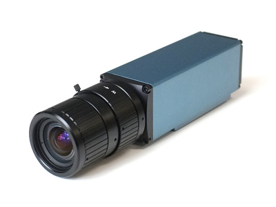

# What is a SCIF?

Sensitive compartmented information facility (SCIF) is a term used by U.S.
military and intelligence organizations to describe secure, enclosed areas
designated for handling sensitive, classified information. They come in many
different shapes and sizes, each designed for a specific mission demand. They
can be installed permanently in buildings, designed as mobile units, set up
temporarily, and even built aboard aircraft and naval vessels. What unites these
different variants is the common goal of creating a designated space with
rigorous security practices that thwarts all relevant passive outside observers
and active attackers.

SCIFs are by no means exclusive to U.S. government institutions. They are used
internationally by a wide variety of actors, from other governments to
international organizations to corporations and NGOs. The term has become the
most commonly used and will also be used in this paper to refer to structures
specifically built to protect information processed inside them.

Most countries keep their specifications for these secure facilities secret.
The United States, however, have published comprehensive information on their
engineering practices under Intelligence Community Directive (ICD) 705
"Sensitive Compartmented Information Facilities" and its associated technical
specifications. In this paper, ICD 705 will be supplemented by private
contractors' informational material, documents released under the Freedom of
Information Act (FOIA), leaked documents, and scientific literature to create a
comprehensive picture of the current state of the art and give an outlook on
future improvements.

# Information Security - Ideal State and Practical Tradeoffs

A communication link or room is considered secure if information travelling
through it cannot be intercepted by unauthorized parties. This is a theoretical
ideal state that _cannot_ be reached. However, one can employ various
countermeasures to secure a communication link or room to such a degree that it
can be practically considered as secure against an attacker with certain
resources.

Both defenders and attackers are constrained by limited resources. Viewing
attack techniques from a resource perspective allows a defender to determine
whether they are "in scope", given the threat level, and if countermeasures must
be deployed against them. Resources are best expressed in terms of cost, time,
and technical skill required. Taking into account these parameters, the defender
is able to develop a mission-specific threat model that allows him to employ his
_limited_ resources effectively to defend against the most likely and serious
attacks.

The IC Tech Spec‐for ICD/ICS 705 [@ics-705-ts, p. 20] bases its threat
modelling on country-level threat ratings derived from the Department of
State's (DoS) Security Environment Threat List (SETL). Specifically, the ICD
establishes appropriate construction criteria based on the host country's SETL
technical threat rating. A country-level view is most useful to government
organizations, however, other actors, especially corporate actors, may have to
rely on different factors to determine threat level. Other possible criteria
from which to derive a threat level include value of information handled and
named/identified threats.

The fundamental assumption for threat modelling is that it is highly unlikely
for an attacker to expend more resources to carry out an attack than the
objective value of the attainable information.

# Passive Outside Observer

There are various information sources that can leak from the secure facility
and be intercepted. These can generally be grouped into visual, acoustic, and
electromagnetic information source leaks. A passive observer can use different
sensors, like telescopic cameras, directional microphones, and high-sensitivity
anntenae, to capture and analyze these information source leaks and draw
conclusions about the sensitive information processed. A covert location
outside the SCIF perimeter is almost impossible to detect and counteract.
Therefore, information leaks must be prevented at the source.

## Visual

Visual leaks are any direct view of sensitive information or surface whose
reverberations can be captured with a laser and then translated into usable
information. When speaking, glass panes or mirrors in a room are set into
vibration. When there is visual insight into the room (e.g. from the
neighboring building), a laser beam can be directed onto these reflecting
surfaces and the reflected beam can be received again. The reflected beam is
modulated by the oscillations. By demodulation, the conversation can be made
audible [@wolfsperger2008, p. 463]. Direct views can also provide valuable
insights into information processed and even serve as a basis for other
attacks, like lip-reading of sensitive discussions.

Barring holes in the SCIF perimeter, like propped-open doors, visual leaks can
only be captured through windows.

{height=35%}

Capture Technique | Cost | Time | Technical Skill Required
--- | --- | --- | ---
Direct View | medium | low | low
Lip Reading | medium | low | medium
Reverberations Captured by Laser | [high](https://www.detective-store.com/laser-parabolic-microphones-166) | low | medium

## Acoustic

Acoustic leaks are sound waves that escape the enclosed areas, either directly
or through structure-borne sound transmission. These can be captured with
directional microphones, contact microphones, and well placed conventional
microphones. An example of such an advantageous placement would be in an
unmuffled ventilation or heating duct.

Acoustic leaks provide some of the most valuable insights. Discussions,
conferences, and chatter contain secrets in their purest form. Through them, an
attacker doesn't only attain sensitive material, he also gains insight into
underlying priorities and considerations, much more so than from a leaked
document. Like Christoph Waltz's character from the 2009 Quentin Tarantino film
"Inglourious Basterds" says "I love rumors! Facts can be so misleading, where
rumors, true or false, are often revealing."

{height=30%}

Digital sound processing software can further enhance an outside passive
attackers capabilites to reconstruct, clarify, and analyze sound leaks.

Capture Technique | Cost | Time | Technical Skill Required
--- | --- | --- | ---
Directional Microphones | [medium](https://www.detective-store.com/laser-parabolic-microphones-166) | low | low
Contact Microphones | [low](https://www.abhoertechnik.com/mikrofone/lausch-stethoskop.html) | medium | medium
Conventional Microphones | low | medium | medium

## Electromagnetic/TEMPEST

Compromising electromagnetic waves unintentionally emitted from information
processing equipment, like computers, screens, and even printers are another
source for information leaks. These radio or electrical signals, sounds, and
vibrations can be captured with antennae, microphones, and other sensors, and
allow inferences to be made about the information processed, sometimes even
allowing its complete reconstruction [@liu2020]. They can also serve as a
side-channel for attacks on cryptography [@genkin2015]. The techniques for
extraction and analysis of compromising electromagnetic emanations fall under
the commonly used U.S. National Security Agency codename TEMPEST [@tempest].

These attack techniques require high technical skill to develop, however once
established are easy and fast to reproduce with [affordable
equipment](https://greatscottgadgets.com/hackrf/one/). Although execution is
fast, reconnaissance, planning and setup, especially for well-protected
facilities, can entail significant time expenditure.

{height=40%}

Capture Technique | Cost | Time | Technical Skill Required
--- | --- | --- | ---
Direct Leaks | low | medium | high
Side-channel on Cryptography | low | medium | high

# Limits

This section will set quantitative limits on information sources available to an
outside passive observer. Since information source leaks must be protected at
the source, it is important to know the extent of attenuation necessary to
assure adequate protection.

## Visual

No visual information should be accessible to an outside passive observer.
Visual information source leaks are the easiest to avoid and should therefore be
wholly prevented. Even observation of the entrypoint could provide insights into
the comings and goings of authorized personnel and should therefore be obscured
as much as possible.

## Acoustic

Acoustic emissions must be reduced by at least a weighted sound reduction index
of R'~w~ = 52 dB. This measure roughly corresponds to the Sound Transmission
Class 50 listed in the IC Tech Spec‐for ICD/ICS 705 as an enhanced rating for
areas that provide for amplified conversations [@ics-705-ts, p. 66]. We use this
as a general minimum measure, because the IC Tech Spec is geared towards
military and other government facilties that provide a large measure of Security
in Depth (SID), meaning that only semi-trusted personnel ever get within earshot
of the SCIF. Security in Depth is a "multilayered approach, which effectively
employs human and other physical security measures [like fences, walls, and
guarded entry gates] throughout the installation or facility to create a layered
defense against potential threats" [@navfac, p. 20]. Additionally, SID increases
the probability of detection of nefarious activity because of continuous
friendly-forces presence [@ics-705-ts, p. 3]. These conditions cannot be
guaranteed for all locations, especially in the corporate realm, so we strive to
compensate reduced SID with a higher degree of sound insulation.  When possible,
R'~w~ = 52 dB should be exceeded.

R'~w~ represents the resulting sound insulation between two rooms, taking into
account all sound transmission paths [@tichelmann2000, p. 26]. This explicitly
includes not only transmission through dividing components, but also so-called
"flank transmission" over adjoining building components. In this phenomenon
sound waves cause vibrations in flanking walls and then linearly travel through
them into the other room [@moeser2009, p. 254]. R'~w~ is a cummulative value
calculated on the basis of the weighted sound reduction index of each component
R~w~ [@tichelmann2000, p. 34].

R~w~ is calculated by measuring sound transmission from one test cabin into
another divided by the test component. The test is carried out in one-third
octave or octave steps. White noise, a random signal with equal intensity across
different frequencies, with the given bandwidth is used as test sound. A
frequency response curve R is thus obtained in the so-called building-acoustics
frequency range between 100 Hz and 3.15 kHz. The frequency response curve R is
then compared to a reference curve B in order to derive a single comparison
value. In the comparison, the reference curve is shifted in 1 dB steps onto the
frequency response curve until the sum of the undershoots S~U~ of the frequency
response curve compared to the reference curve is less than 32 dB. [@moeser2009
pp. 256-257]

{height=40%}

From this diagram we can also see that for a R~w~ = 52 dB (the reference curve)
the fundamental frequency of the male voice - 125 Hz - only undergoes a sound
attenuation of ca. 35 dB. Given a 60 dB conversation sound-level the sound
attenuation is not sufficient to protect from a close proximity attacker.
Passive sound-attenuation measures should be specifically evaluated in the 125
Hz to 300 Hz range, and significantly exceed the reference curve's performance.

Airborne sound transmission via ventilation and structure-borne sound
transmission via ducts, such as water and ventilation pipes, can significantly
reduce sound insulation [@din4109-1, p. 19]. In some cases they can even provide
direct channels for an outside observer to capture sound on [@ics-705-ts, p.
13]. Hence, they must be treated with special attention. A mistake on a
component penetrating the SCIF perimeter, like a duct or vent, can render
useless all other attenuation.

## Electromagnetic/TEMPEST

Electromagnetic emissions should be reduced by the values defined in National
Security Specification for Shielded Enclosures NSA 94-106. This specification
sets forth an attenuation for a 1 kHz - 1 MHz H (magnetic) Field of 20 dB @
1KHz, 56 dB @ 10 kHz 90 dB @ 100 kHz, and 100 dB @ 1 MHz. For a 1 kHz - 10 MHz
E (electromagnetic) Field it requires 70 dB @ 1kHz, and 100 dB at 10 kHz, 100
kHz, 1 MHz, and 10 MHz. For a 100 MHz - 10 GHz Plane Wave it also requires 100
dB attenuation.

{height=40%}

The field test is carried out with a parallel setup. A continuous wave source
generates a wave in the range of 1 KHz to 10 GHz. Two antennae are placed, one
on either side of the shielding. One antenna acts as a transmitting (TX) antenna
and the other as a receiving (RX) antenna. The antennae are separated by a
distance of 61 centimeters plus the wall thickness. The signal from the RX
antenna is fed back into a reciver. Attenuation levels can then be read from a
spectrum analyzer. Magnetic field, electronic field, and plane wave attenuations
are then measured at various specified frequencies.  Attenuation tests are
performed around the entire door frame, air ducts, filters and through any
accessible joint or penetration. [@nsa94-106]

{height=40%}

A RF shielding system is only as effective as its weakest component [@krieger].
Shielding material faults and gaps in the shield should be carefully avoided.
These holes become more critical the higher the frequency of the shielded field
[@wolfsperger2008, pp. 292-293].

Apart from airborne electromagnetic waves, emanations can also leak from a SCIF
on cables and wires. Instead of travelling through the air, unwanted signals
can travel along wires out of the SCIF [@wolfsperger2008, p. 210] inducing
electromagnetic fields where they can be captured and turned into usable
intelligence. With the right setup using different tools for power, data, and
control connections these information source leaks can be entirely eliminated.

# Active Attacker

Apart from passively observing information source leaks from outside the secure
facility, an attacker can also actively attack the space to place sensors inside
the SCIF and transmit sensitive visual, acoustic, or electromagentic information
to the outside. He can also seek to weaken the passive attenuation in order to
increase the information yield of passive observance.

This chapter intends to give some general ideas about possible attack vectors,
not to list out specific attacks and describe their execution. New attack
methods are constantly being developed and only few ever get published.
Thankfully most can be prevented by sticking to the same established general
countersurveillance measures and security practices.

## Visual

The goal of all visual attacks is to place cameras inside the SCIF. These
cameras allow an attacker to gain valuable insights into the sensitive
information being handled or processed inside the enclosed area. Cameras can be
inserted by someone who gains physical access to the space, inserted through
HVAC ducts, or drilled through the perimeter.

Another attack avenue is taking over installed CCTV cameras. The video feed from
these cameras could allow insights into the SCIF's comings and goings, and, with
badly placed cameras, even into the information processed. This attack can also
target the built-in cameras of information processing equiptment like laptops.

Cameras transmit video feeds to the outside using radio/electromagnetic waves or
wired connections. Wired connections could be specially installed for the attack
or hijack existing lines, either directly or as emanations along their
unshielded exterior.

Attack Technique | Cost | Time | Technical Skill Required
--- | --- | --- | ---
Inserting Camera |  low | low | medium
Hijacking Existing Camera | low | medium | high

## Acoustic

An attacker may also attempt to place a microphone in the SCIF. To do this he
can either physically insert a new microphone or hijack one of the built-in
microphones of devices already located in the room. Acoustic information is
usually most sensitive, especially in conference rooms or discussion areas.

Similar to visual attacks, avenues for placing a microphone are physical entry,
HVAC ducts, and hole drilling. In order to exfiltrate information the attacker
again utilizes either radio/electromagnetic waves or wired connections, existing
or specially placed. Another attack is finding a weak spot in the sound
attenuating shell and placing a contact microphone directly on it.

{height=20%}

An attacker could also seek to weaken the sound attenuation measures by
tampering with the sound masking, destroying insulation or purposely creating
sound bridges.

Attack Technique | Cost | Time | Technical Skill Required
--- | --- | --- | ---
Mic over Existing Lines | low | medium | high
Mic over Specially Placed Lines | medium | high | high
Mic Wireless | low | low | medium
Contact Microphone on Weak Spot | low | medium | medium
Hijacking Existing Microphones | low | low | high
Weakening Sound Attenuation | medium | medium | high

## Electromagnetic/TEMPEST

Instead of passively capturing TEMPEST emanations from outside the SCIF
perimter, an attacker could also seek to place an antenna within the SCIF. He
could then amplify the signals and thereby overpower the shielding or exfiltrate
them on some other channel. He could also seek to weaken the electromagnetic
shield by purposely creating holes in it or tampering with protective equipment,
like power line filters.

Electromagnetic attacks are possible, but it is more likely that an attacker
would place acoustic or visual sensors, which provide more direct insight into
sensitive information, given the physical access necessary for these types of
attacks.

Another attack is taking over devices present in the room and using their
wireless capabilities to capture TEMPEST emanations. If these devices are
network-connected, an attacker could exfiltrate data on their normal data
connection, without having to setup an additional exfiltration path. However,
similar to the insertion of bugging devices it is more likely that he will use
this high level of operating system access to hijack the device's microphone or
camera.

Attack Technique | Cost | Time | Technical Skill Required
--- | --- | --- | ---
Antenna + Amplification | low | medium | low
Antenna + Existing Lines | low | medium | high
Antenna + Placed Lines | medium | medium | high
Weakening Shield | medium | medium | medium
Hijack Existing Device | low | medium | high

# Countermeasures

## Physical

### Construction Security

Later passive and active countermeasures are completely ineffective if the SCIF
is breached during construction. Therefore meticulous preparation of and
adherence to a Construction Security Plan (CSP) is required. The CSP covers
construction personnel, site perimeter, site access, and construction materials.

#### Construction Personnel

Construction personnel must be vetted and monitored so that they do not pose an
insider threat to the construction site and resulting facility. The IC Tech
Spec‐for ICD/ICS 705 [@ics-705-ts, pp. 23-27] provides for evaluation of
construction workers by origin and clearance level. For example, it forbids the
use of workers from SETL threat level "critical technical threat level."
Furthermore, it requires biographical data (full name, current address, Social
Security Number (SSN), date and place of birth (DPOB), proof of citizenship,
etc.) and fingerprint cards for background checks of all non-cleared
construction personnel. It requires finish work in high-threat countries to be
carried out by SECRET-cleared U.S. personnel and requires access to the site to
be withdrawn if adverse security, Counterintelligence (CI), or criminal activity
is detected. It also sets various requirements for the monitoring/accompanying
of non-cleared workers. As an example, for new facilities it allows non-cleared
workers, monitored by Construction Surveillance Technicians (CSTs) - dedicated
personnel that supplement site access controls, implement screening and
inspection procedures, as well as monitor construction and personnel - to
perform the installation of major utilities and feeder lines. It requires that
all construction personnel receive a security briefing prior to entering the
site, so they know which rules to follow and what suspicious activity to report.
If a construction worker leaves the project under unusual circumstances, the ICD
requires the event be documented and the approriate officer to be notified.

Not all these measures for the security vetting of construction personnel can be
implemented by non-government actors. These actors should try to build a staff
of long-term, trustworthy workers or employ a company that does so. Video
surveillance during the construction phase can supplement other monitoring
efforts. However, it requires constant attention, just like any other
non-technological security measure. Even with all the possible security
mitigations and background checking, the human factor as an inside threat remains
one of the most sensitive areas and the hardest to defend against.

Threats from construction personnel can also further be mitigated by careful
inspection after each construction phase's completion and [bug
sweeping](#bug-sweeping) before commissioning of the SCIF.

#### Site Perimeter

Without a secure perimeter, access to and within the site cannot be controlled.
A secure fencing or other form of perimeter should be errected, and continuously
monitored for unauthorized penetration. For renovation projects, barriers should
be installed to segregate construction workers from operational activities,
providing protection against unauthorized access and visual observation. When
expanding SCIF space into uncontrolled areas, maximum demolition of the
uncontrolled areas should be carried out beforehand. This protects against
existing threats and ensures a "clean slate" before building a new SCIF.
[@ics-705-ts, p. 25].

#### Site Access

Access control using badges and other forms of identification should be required
entry to the site. Guards should monitor these entry points to prevent tampering
and penetration attempts. Possible site control measures like identity
verification, random searches, signs listing prohibited items, and vehicle
inspections should be considered and weighed against the SCIF threat model.
[@ics-705-ts, p. 27]

The IC Tech Spec also requires the use of cleared American guards (CAGs) to
supervise non-U.S. and non-cleared U.S. guards, as well as to directly protect
the site in high-threat, SETL category I countries. No equivalent to CAGs exists
in the private sector. Their loyalty is difficult to recreate for a private
actor who can't offer the same long-term employment and ideoligical motivation.
However, guards with a similar training level can be sourced from private
suppliers and with organizational practices like supervision and vetting an
adequate level of security can be ensured.

#### Construction Materials

Construction materials must be procured, transported, and stored in a secure
way. If not, the entire security of the finished SCIF can be jeapordized by
faulty or compromised materials. Inspectable materials are those that can be
reasonably inspected with available measures. All other materials, as well as
inspectable materials on which approved test methods were not carried out, are
classified as non-inspectable and are subject to higher security requirements.

Inspectable materials can be procured from trusted suppliers without further
security restrictions. Inspectable materials from non-trusted suppliers or
shipped to the site in an unsecured manner should be inspected using approved
methods and then moved to a secure storage area (SSA). If stored outside the
SSA, a random selection of these materials should be inspected before use on the
site. Non-inspectable materials should be procured from trusted suppliers or
other approved channels and securely transported to the SSA. They can also be
procured from untrusted suppliers if randomly chosen by trusted personnel from a
suppliers shelf-stock without advance notice or indication of the intended use.
No discernible purchasing patterns should be established while carrying out this
randomized procurement procedure. [@ics-705-ts, pp. 27-29]

Secure transporation is not required for inspectable materials if they are
inspected and then immediately placed in an SSA. If securely procured, shipped
and stored inspectable materials may even be utilized without inspection.
Non-inspectable materials, should be transported securely packaged or
containerized and under the 24-hour control of an approved courier or escort
officer. If this is not possible they should be securely shipped using approved
transit security technical safeguards capable of detecting evidence of tampering
or compromise. For government actors it may be interesting to require the
transporation by military or flag carrying vessels. [@ics-705-ts, p. 30]

A secure storage area is a true floor to true ceiling, slab-to-slab construction
of some substantial material, and a solid wood-core or steel-clad door equipped
with a security lock. All inspected and securely shipped materials should be
placed in the SSA immediately upon arrival and stored there until they are
required for installation. Alternatively a shipping container located within a
secure perimeter that is locked, alarmed, and monitored or a room or outside
location enclosed by a secure perimeter that is under direct observation by
cleared personnel can be used as an SSA. [@ics-705-ts, p. 31]

#### Inspection Methods

X-Ray, visual inspection, metal detectors and destructive tests can be used on
inspectable materials to ensure their integrity. See [@checklist] for a detailed
list of inspection methods and their uses.

#### Technical Security

The construction phase involves many different parties and material suppliers.
It is almost impossible to defend against against down the entire supply chain.
Security measures are only suitable to completely prevent the most primitive
attacks and only serve to make advanced attacks more difficult. Therefore, a
technical surveillance countermeasure (TSCM) [inspection](#bug-sweeping) should
be carried out at all major construction milestones and before commissioning of
the SCIF. This can effectively mitigate the impact of security breaches in the
construction phase.

### Intrusion Resistance

A secure perimeter is the foundation of a SCIF's security. Only it can prevent
brute-force entries into the protected space. Without it, no other access
control or locking measures are effective.

A multi-layered approach, using security in depth (SID), is most effective in
ensuring a SCIF's physical security. The multiple layers can be a controlled
perimeter, a secure installation, a building perimeter, an area surrounding the
SCIF, and/or the SCIF Perimeter itself. If one of these layers is not existant
in a sufficient degree it may be possible to supplement by beefing up one of the
other layers.

{height=40%}

The SCIF perimeter itself should be made from a substantial material that is
difficult to penetrate in a covert way. The IC Tech Spec‐for ICD/ICS 705
[@ics-705-ts, pp. 8-10] proposes different wall makeups for varying mission
demands. For example, an open storage facility - one in which sensitive
information is stored openly and left out when not in use without further
protection [@navfac, p. 16] - without SID requires a true-floor to true-ceiling
wall made up of (from controlled to uncontrolled side) two 5/8" gipsum wall
boards (GWB), ¾" #9 10 gauge expanded metal spot-welded or screwed every 6" to
vertical studs, 16" metal studs and runners, acoustic fill, another 5/8" GWB.
Specifically the combination of multiple GWBs and expanded metal makes for a
very sturdy construction. Additionally, sheet metal laminated GWB, like Knauf
Diamant Steel, can be used to further enhance the resistance capabilities of the
GWB. Windows are highly discouraged for security reasons [@ics-705-ts, p. 12].

![Wall B -Suggested Construction for Expanded Metal [@ics-705-ts, p.
17]](images/wallb.png){height=40%}

There should be only one primary entrance door to simplify personnel and visitor
controlled entry. This door should be of a substantial material, like 1 ¾
inch-thick solid wood core or 1 ¾ inch-thick face steel. Its hinge pins should
be located inside the SCIF perimeter or modified to prevent removal of the door,
e.g., welded or set screws. [@ics-705-ts, pp. 11-12]

The alarm response time criteria on [@ics-705-ts, p. 14] requires a maximum
response time of 15 minutes. Assuming that the door should resist entry for the
entire alarm response time, i.e. an attacker should be captured before he
breaches the door, this requirement roughly translates to DIN EN 1627
Resistance Class 5. RC 5 entails that an experienced attacker using hand tools,
power tools, such as a drill, jigsaw or reciprocating saw and an angle grinder
with a max. disc diameter of 125 mm can't breach the door within 15 minutes. A
SCIF door setup should meet or exceed this standard.

Closed storage of sensitive information in a security container is preferrable
over open storage when the SCIF is not in use. Even better, sensitive
information should be stored in a separate vault when the SCIF is not in use. A
security container according to the IC Tech Spec‐for ICD/ICS 705 [@ics-705-ts,
p. 5] must be a General Services Administration (GSA) approved safe, which
typically complies to GSA Class 6 for storage of classified information such as
documents, maps, drawings, and plans [@navfaclocks]. GSA Class 6 has no forced
entry requirements, but requires 30 minutes resistance to covert entry and 20
hours resistance to surreptitious entry. Commercial cabinets meeting EN 14450
Grade S2 likely also fulfill the requirements of GSA Class 6.

{height=30%}

### Intrusion Detection System

An intrusion detection system (IDS), also called alarm system, is essential in
securing a SCIF against attackers. It allows quick detection and response to
penetrations of the secured area. Multiple sensors are used in conjunction with
a monitoring station to ensure round-the-clock alerts to unauthorized entry of
any kind.

Mainly, the IDS is used to secure the SCIF when it is unoccupied. All interior
areas through which access could be gained, including walls and doors, should be
protected by IDS. Special attention should be given to detecting and responding
to system outages and tampering. Limiting false alarms to a maximum of one per
30 days further ensures the reliability and effectiveness of the system, as too
many false alarms cause fatigue and desensitization of security personnel. The
IDS should be stand-alone, i.e. independent of other facilities' alarm systems.
It can be supplemented with [audio or video monitoring](#cctv) if special
attention is given not to inadvertently jeopardize the SCIFs information
security.  [@ics-705-ts, p.  53]

All components, i.e. the monitoring station, movement sensors, high security
switches (HSS), premise control unit (PCU), and keypads should meet the
internationally recognized Underwriters Laboratories (UL) Standards 2050, 639,
634, 1610 and/or 294 respectively. The UL, being an independent, international
organization not complying to the standards of any one country, is most suitable
for providing globally recognized and universal security standards for the
purposes of this paper.

The IDS should allow for operating in access, secure, maintenance, and
shunted/masked mode. Access mode is used during SCIF operation and should allow
for normal entry without causing an alarm. Tampering or entry through a
secondary point, like emergency exits, should continue to trigger an immediate
alarm. Secure mode is used when the SCIF is unoccupied, i.e. the last person
departs the SCIF. Any unauthorized entry into the SCIF should cause an alarm to
be immediately transmitted to the monitoring station in secure mode. In general,
there should be no remote capability to change between these modes. Maintenace
mode is used during routine repairs and testing on the system. An signal for
this condition should be automatically sent to the monitoring station and
verified/recorded there. Generally speaking, there should be no remote access
for diagnostics, maintenance or programming for security reasons. It might also
become necessary to shunt/mask sensors and zones for other reasons, like
unforeseen malfunctioning of specific components, however this must be displayed
at the monitoring station through the period the condition exists and
automatically limited in time to the next change from access to secure mode.
[@ics-705-ts, pp. 57-58]

Electrical power supply of the IDS must be redundant, e.g. backed by 24 hours of
uninterruptible power supply (UPS). On primary power failure, the IDS should be
automatically transferred to emergency electrical power without causing an
alarm. An indicator of the power source in use should be given at the PCU or
monitoring station. [@ics-705-ts, p. 58]

The monitoring station must comply to UL 2050, which sets out standards for
organizations monitoring, signal processing, investigating, servicing, and
operating alarm systems in sensitive facilities [@convergint]. Governments
themselves or private contractors can set up monitoring stations that meet these
standards.  These stations should be staffed by human operators trained in
system theory and operation to effectively interpret system incidents and take
appropriate response action. Any alarm event along with time of receipt, names
of responding personnel, dispatch time, nature of the alarm, and follow up
actions should be recorded there for at least two years. [@ics-705-ts, p. 59]

Sensors are the eyes and ears of an IDS. They detect breaches and trigger
alarms. All sensors should be located inside the SCIF to prevent tampering and
TEMPEST issues. Interior areas of a SCIF through which reasonable access could
be gained should be monitored by motion sensors (UL 639) and high security
switches (HSS) (UL 634 level 1 or 2). Motion sensors trigger alarms on detecting
movements in their view. HSS split in two, one half mounted on moving components
and the other on an adjacent rigid part. They trigger alarms when they lose
internal contact between their two halfs, for example when a door is opened.
SCIF perimeter doors should be protected by both an HSS and a motion sensor.
Failed sensors should cause continuous alarm until repaired. [@ics-705-ts, pp.
54-55] Seismic detectors, sensors that trigger on vibrations such as those
resulting from drilling and blastic, can further be used to supplement HSS and
motion sensors. There are impressive innovations in the realm of motion sensors
such as passive infrared detecting attacker's body temperature, doppler radar
catching attacker's radar reflections, cloak and camouflage detection against
intrudersattempting to cover their infrared signal, and anti-masking technology
against attempts to obscure the field of view of the detector [@boschtriptech].

Premise Control Units (PCU) serve as a first point of control inside the SCIF.
They as well as any associated cabling should be fully located within the SCIF
perimter. PCU should validate authorized use with an authentication technology,
such as a keypad and/or card reader. Cabling between all sensors and PCU should
be dedicated to the IDS and contained within SCIF. Otherwise "External
Transmission Line Security" must be employed. The alarm status as well as power
source in use should be continuously displayed at the PCU. A special indicator
should alert to changed/failed power supply. The PCU should identify and display
all activated sensors. The auto-alarm reset feature, if present, must be
disabled as every security incident can only be resolved after an inspection of
the SCIF and a determination for the cause of the alarm by trained personnel.
Because of the sensitive nature of the information displayed, the PCU must be
installed in a location that precludes observation by any unauthorized party.
[@ics-705-ts, p. 55]

Immediate and continuous alarm must be given on any intrusion detection, failed
sensor, tamper detection, or enabling of maintenance mode (maintenace message
may be used in place of alarm). Alarms or maintenace messages should be
displayed individually for all zones shunted or masked during maintenance mode.
[@ics-705-ts, p. 55]

Once an IDS is set up to the above specifications, thorough acceptance testing
should be carried out before the SCIF is commissioned. Motion sensors should be
tested by moving at very slow speeds through the monitored area. This speed
should not exceed 800 mm per second. The movements should be repeated throughout
the SCIF and from different directions. The alarm must be activated at least
three out of every four trials. HSS should be tested to ensure that an alarm
activates before the non-hinged side of the door or window opens beyond its own
thickness from the closed position. For example, this means that the HSS
triggers an alarm before the door opens 5 cm for a 5 cm door. Tamper testing
should be carried out by ensuring that alarms are triggered when IDS equiptment
covers are opened, both in secure and access mode. These test procedures should
be repeated at least semi-anually. [@ics-705-ts, pp. 60-61]

### Access Control

An access control system (ACS) is employed while the SCIF is occupied to control
and record personnel entry into the protected space. It is mounted in addition
to the SCIF perimeter door lock to regulate access while the SCIF is in use. It
does not replace this lock while the SCIF is unoccupied. [@ics-705-ts, p. 62]

Visual recognition of persons entering the SCIF by an authorized person at the
entrance to a SCIF is the ideal access control. Should this not be possible an
automated system can be used instead. [@ics-705-ts, p. 62]

An automated personnel ACS should use two different credentials, such as ID
badge/card, PIN, and biometric identifier, to verify authorized personnel. The
probability of an unauthorized individual gaining access must be no more than
than one in ten thousand.  Card readers, keypads, communication interface
devices, and other access control equipment located outside the SCIF must be
tamper-protected and securely fastened to a wall or other fixed structure.
Electrical components, associated wiring, or mechanical links should only be
accessible from inside SCIF. Otherwise transmission lines to and from outside
SCIF must be FIPS-AES certified encrypted. Equipment containing access-control
software used to program in authorized persons and remove no longer authorized
individuals should be located fully inside the SCIF. Electric door strikes used
to unlock the door and "buzz people in" must have a  positive engagement, i.e.
rest in a locked position and only unlock on entry authorization. The electric
door strikes should comply to UL 1034 (Burglary-Resistant Electric Locking
Mechanisms). [@ics-705-ts, p. 63]

Records should be kept of the active assignment of ID badge/card, PIN, level of
access, recent entries, and other similar system-related information. Records of
personnel removed from the authorized persons list should be retained for two
years.  Records of security incidents should be retained for five years from the
date of the incident or until the corresponding investigation is resolved.
[@ics-705-ts, p. 63]

If the number of personnel that require access is low and there is only one
entrance a non-automated access control may be used. This can consist of a
mechanical, eletric or electromechanical combination lock with combinations of
four or more random digits. Mechanical access control devices should be
installed to prevent manipulation or access to mechanisms used for setting the
access combination from outside door.  For all non-automated mechanisms, the
control panel or keypad should be installed to preclude unauthorized observation
of combination entry or actions of combination change. The control panel with
combination, cabling and wiring should be located inside the SCIF with
sufficient physical security to deny unauthorized access to its mechanisms.
[@ics-705-ts, p. 64]

### Locks

When not occupied, SCIFs should be alarmed and secured with a FF-L-2740A
compliant combination lock and a pedestrian door deadbolt meeting Federal
Specification FF-L-2890 [@ics-705-ts, p. 11]. The combination lock is used to
secure the door when the SCIF is unoccupied and the access control device is
used when the SCIF is occupied [@ics-705-ts, p. 63]. The equivalent
international specifications for combination locks are UL 768 and DIN EN 1300.
The lowest UL 768 rating, Group 2, is essentialy equivalent to FF-L-2740A
[@lockreference].

{height=40%}

Combinations to locks installed on perimeter doors should be changed when a
combination lock is first installed, when a combination has been compromised,
and whenever a person knowing the combination no longer requires access to it
unless other sufficient controls exist to prevent access to the lock.
[@ics-705-ts, p. 83]

### CCTV

Video surveillance, also known as CCTV, can be used to supplement the
monitoring of SCIF entrances for the remote control of doors from within SCIF.
Special attention should be given to a CCTV system to make sure that it
presents no technical security hazard. [@ics-705-ts, p. 64]. CCTV may be also
used to supplement monitoring of the SCIF entrance and record events for
investigation [@ics-705-ts, p. 75].

When CCTV is used to monitor a SCIF entrance for ACS purposes, the remote
control device should be located within SCIF and should be monitored/operated
by indoctrined personnel. The cameras should provide a clear view of SCIF
entrance without enabling a viewer to observe classified information when the
door is open nor external control pads or access control components that would
enable them to identify PINs or access procedures. The CCTV communication lines
should be fully located within SCIF. Any external communication lines should be
installed to prevent tampering. [@ics-705-ts, p. 64]

When CCTV is used to monitor a SCIF entrance for security and record-keeping
purposes the system and all its components, including communications and
control lines, should be exterior to SCIF perimeter. In this case it must also
not enable a viewer to observe any classified information or authentication
procedures.

In both cases special attention must be given that the cameras present no
further technical security risk. Chinese-made video surveillance systems can be
reasonably suspected of leaking information back to their Chinese State
owned/controlled manufacturers [@cis], like HikVision and Dahua, and suffer from
general bad security practices [@us-cert]. Their use has consequently been
banned from U.S.  government agencies and facilities [@ndaa2019]. In general,
proprietary products suffer from this kind of backdoor-risk and should only be
sourced from trustworthy manufacturers. Even better, they should be built
in-house with [open hardware](https://www.elphel.com/) components.

{height=30%}

## Visual

## Acoustic

### Sound Attenuation

### Sound Masking

### Microphone Jamming

## Electromagnetic/TEMPEST

### Electromagnetic Shielding

### System Monitoring

### Signal Jamming

## Bug Sweeping

# Example Module

This section will propose an example solution for a Sensitive Compartmented
Information Facility (SCIF). It will employ the above passive and active
countermeasures in a shipping container sized (~ 6 x 2.4 x 2.7 m) module to
reach the quantitative limits on information source leaks defined above.

## Physical

## Visual

## Sound

## Electromagnetic/TEMPEST

# References
