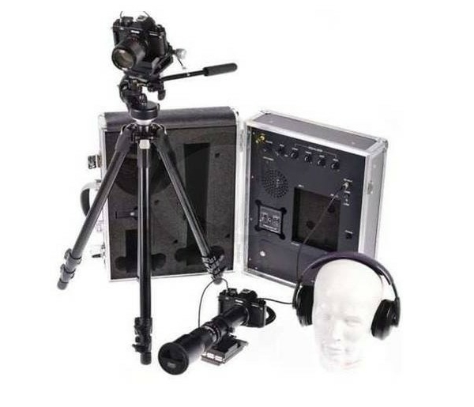
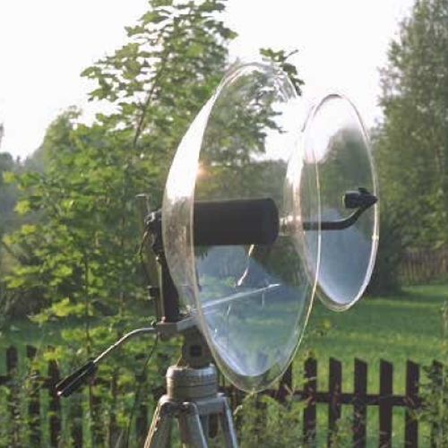
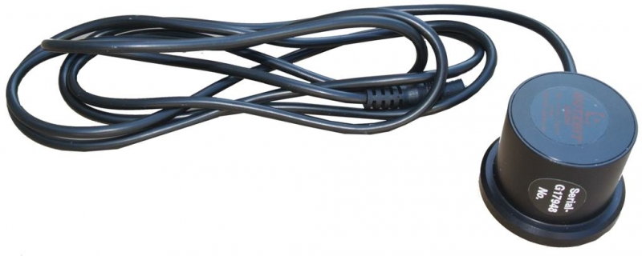
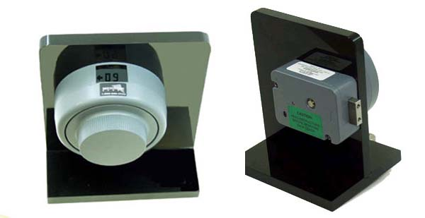
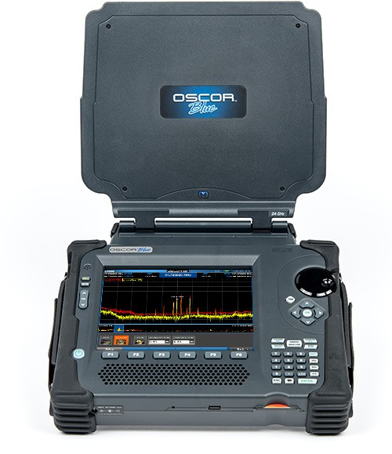
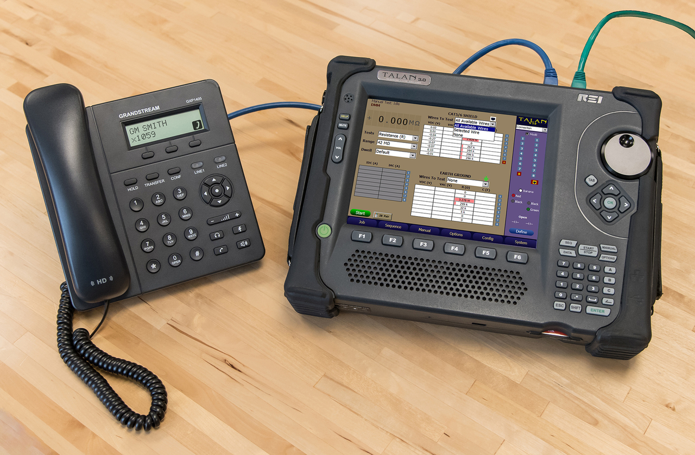
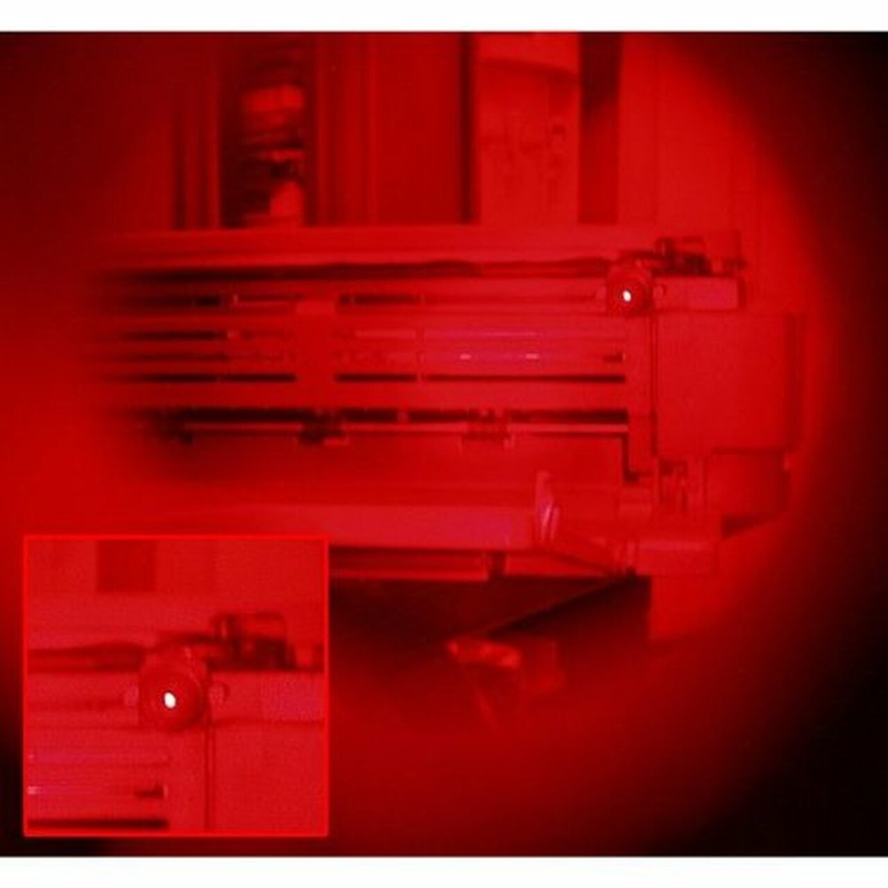
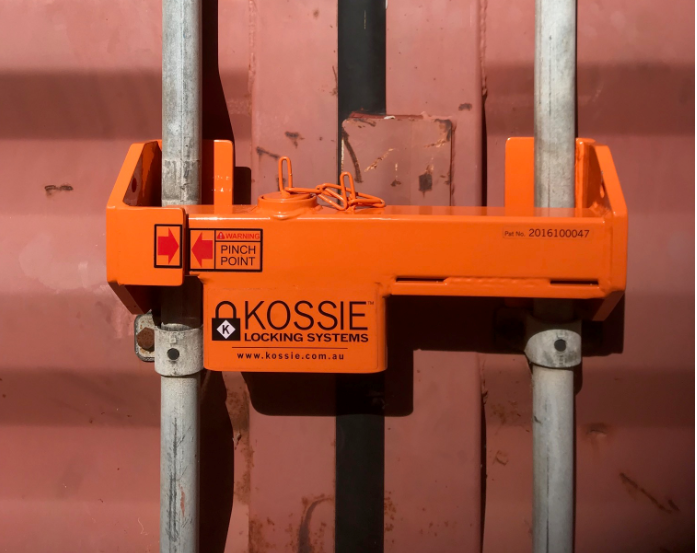
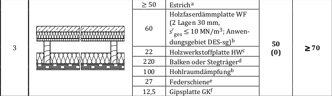

# What is a SCIF?

Sensitive Compartmented Information Facility (SCIF) is a term used by U.S.
military and intelligence organizations to describe secure, enclosed areas
designed for handling sensitive, classified information. They come in many
different shapes and sizes, each designed for a specific mission demand. They
can be installed permanently in buildings, aboard aircraft or naval vessels,
designed as mobile units or set up temporarily. What unites all SCIF variants is
the common goal of creating a designated space with rigorous security practices
that thwart all relevant passive outside observers and active attackers.

SCIFs are by no means exclusive to U.S. government institutions. They are used
internationally by a wide range of actors, from other governments to
international organizations to corporations and NGOs. The term SCIF has become
the most commonly used and will also be used in this paper to refer to
structures specifically built to protect information processed/discussed inside
them.

Most countries keep their specifications for these secure facilities secret.
The United States, however, have published comprehensive information on their
engineering practices under Intelligence Community Directive (ICD) 705
"Sensitive Compartmented Information Facilities" and its associated technical
specifications. ICD 705 will serve as a basis for this paper. It will be
supplemented by private contractors' informational material, documents released
under the Freedom of Information Act (FOIA), leaked documents, and scientific
literature to create a comprehensive picture of the current state of the art and
an outlook on future improvements.

# Information Security - Ideal State and Practical Tradeoffs

A communication link or room is considered secure if information travelling
through it cannot be intercepted by unauthorized parties. This is a theoretical
ideal state that _cannot_ be reached. However, one can employ various
countermeasures to secure a communication link or room to such a degree that it
can be practically considered secure against an attacker with certain resources.

Both defenders and attackers are constrained by limited resources. Viewing
attack techniques from a resource perspective allows a defender to determine
whether they are "in scope", given the threat level, and if countermeasures must
be deployed against them. Resources are best expressed in terms of cost, time,
and technical skill required. Taking into account these parameters, the defender
is able to develop a mission-specific threat model that allows him to employ his
_limited_ resources effectively to defend against the most likely and serious
attacks.

The IC Tech Spec‐for ICD/ICS 705 [@ics-705-ts, p. 20] bases its threat modelling
on country-level threat ratings derived from the Department of State's (DoS)
Security Environment Threat List (SETL). Specifically, the ICD establishes
appropriate construction criteria based on the host country's SETL technical
threat rating. A country-level view is most useful for government organizations,
however, other actors, especially corporate actors, may have to rely on
different factors to determine threat level. Other possible criteria from which
to derive a threat level include value of information handled and
named/identified threats.

The fundamental assumption for threat modelling is that it is highly unlikely
for an attacker to expend more resources to carry out an attack than the
objective value of the attainable information.

# Passive Attacks

## The Passive Outside Observer

There are various information sources that can leak from the secure facility and
be intercepted. These can generally be grouped into visual, acoustic, and
electromagnetic information source leaks. A passive observer can use different
sensors, like telescopic cameras, directional microphones, and high-sensitivity
anntenae, to capture and analyze these information source leaks in order to draw
conclusions about the sensitive information processed. A covert location outside
the SCIF perimeter is almost impossible to detect and counteract. Therefore,
information leaks must be prevented at the source.

## Visual Protection

Visual insights are any direct view of sensitive information or surface whose
reverberations can be captured with a laser and then translated into usable
information. When speaking, glass panes or mirrors in a room are set into
vibration. When there is visual insight into the room (e.g. from the
neighboring building), a laser beam can be directed onto these reflecting
surfaces and the reflected beam can be received again. The reflected beam is
modulated by the oscillations. By demodulation, the conversation can be made
audible [@wolfsperger2008, p. 463]. Direct views can also provide valuable
insights into information processed and even serve as a basis for other
attacks, like lip-reading of sensitive discussions.

Barring holes in the SCIF perimeter, like propped-open doors, visual leaks can
only be captured through windows.

{height=35%}

Table: Passive Attack Techniques Overview - Visual

Capture Technique | Cost | Time | Technical Skill Required
--- | --- | --- | ---
Direct View | medium | low | low
Lip Reading | medium | low | medium
Reverberations Captured by Laser | [_high_](https://www.detective-store.com/laser-parabolic-microphones-166) | low | medium

## Acoustic Leaks

Acoustic leaks are sound waves that escape the enclosed areas, either directly
or through structure-borne sound transmission. These can be captured with
directional microphones, contact microphones, and well placed conventional
microphones. An example of such an advantageous placement would be in an
unmuffled ventilation or heating duct.

Acoustic leaks provide some of the most valuable insights. Discussions,
conferences, and chatter contain secrets in their purest form. Through them, an
attacker not only attains sensitive material, but he also gains insight into
underlying priorities and considerations, much more so than from a leaked
document. Like Christoph Waltz's character from the 2009 Quentin Tarantino film
"Inglourious Basterds" says "I love rumors! Facts can be so misleading, where
rumors, true or false, are often revealing."

{height=30%}

Digital sound processing software can further enhance an outside passive
attackers capabilites to reconstruct, clarify, and analyze sound leaks.

Table: Passive Attack Techniques Overview - Acoustic

Capture Technique | Cost | Time | Technical Skill Required
--- | --- | --- | ---
Directional Microphones | [_medium_](https://www.detective-store.com/laser-parabolic-microphones-166) | low | low
Contact Microphones | [_low_](https://www.abhoertechnik.com/mikrofone/lausch-stethoskop.html) | medium | medium
Conventional Microphones | low | medium | medium

## Electromagnetic/TEMPEST Leaks

Compromising electromagnetic waves unintentionally emitted from information
processing equipment, like computers, screens, and even printers are another
source for information leaks. These radio or electrical signals, sounds, and
vibrations can be captured with antennae, microphones, and other sensors, and
allow inferences to be drawn about the information processed, sometimes even
allowing its complete reconstruction [@liu2020]. They can also serve as a
side-channel for attacks on cryptography [@genkin2015]. The techniques for
extraction and analysis of compromising electromagnetic emanations fall under
the commonly used U.S. National Security Agency codename TEMPEST [@tempest].

These attack techniques require high technical skill to develop, however once
established are easy and fast to reproduce with [_affordable
equipment_](https://greatscottgadgets.com/hackrf/one/). Although execution is
fast, reconnaissance, planning and setup, especially for well-protected
facilities, can entail significant time expenditure.

![Display of a Monitor Reproduced on another Using its TEMPEST Emanations and a
$40 Software Defined Radio + Antenna Setup
[@rtl-sdr]](images/tempest.jpg){height=40%}

Table: Passive Attack Techniques Overview - Electromagnetic

Capture Technique | Cost | Time | Technical Skill Required
--- | --- | --- | ---
Direct Leaks | low | medium | high
Side-channel on Cryptography | low | medium | high

# Limits

## Why Set Up Quantitative Limits?

This section will set quantitative limits on information sources available to an
outside passive observer. Since information source leaks must be protected at
the source, it is important to know the extent of attenuation necessary to
ensure adequate protection.

## Visual Insights

No visual information should be accessible to an outside passive observer.
Visual information source leaks are the easiest to avoid and should therefore be
wholly prevented. Even observation of the entrypoint could provide insights into
the comings and goings of authorized personnel and should therefore be obscured
as much as possible.

## Acoustic Attenuation

Acoustic emissions must be reduced by at least a weighted sound reduction index
of $R'_w$ = 53 dB. This measure roughly corresponds to the Sound Transmission
Class 50 listed in the IC Tech Spec‐for ICD/ICS 705 as an enhanced rating for
areas that provide for amplified conversations [@ics-705-ts, p. 66]. We use this
as a general minimum measure, because the IC Tech Spec is geared towards
military and other government facilties that provide a large measure of Security
in Depth (SID), meaning that only semi-trusted personnel ever get within earshot
of the SCIF. Security in Depth is a "multilayered approach, which effectively
employs human and other physical security measures (like fences, walls, and
guarded entry gates) throughout the installation or facility to create a layered
defense against potential threats" [@navfac, p. 20]. Additionally, SID increases
the probability of detection of nefarious activity because of continuous
friendly-forces presence [@ics-705-ts, p. 3]. These conditions cannot be
guaranteed for all locations, especially in the corporate realm, so the goal is
to compensate reduced SID with a higher degree of sound insulation. When
possible, $R'_w$ = 53 dB should be exceeded.

$R'_w$ represents the resulting sound insulation between two rooms, taking into
account all sound transmission paths [@tichelmann2000, p. 26]. This explicitly
includes not only transmission through dividing components, but also so-called
"flank transmission" over adjoining building components. In this phenomenon,
sound waves cause vibrations in flanking walls and then linearly travel through
them into the other room [@moeser2009, p. 254]. $R'_w$ is a cummulative value
calculated on the basis of the weighted sound reduction index of each
component's $R_w$ [@tichelmann2000, p. 34].

$R_w$ is calculated by measuring sound transmission from one test cabin into
another with the test component in between them. The test is carried out in
one-third octave or octave steps. White noise, a random signal with equal
intensity across different frequencies, with the given bandwidth is used as test
sound. A frequency response curve $R$ is thus obtained in the so-called
building-acoustics frequency range from 100 Hz and 3.15 kHz. The frequency
response curve $R$ is then compared to a reference curve $B$ in order to derive
a single comparison value. In the comparison, the reference curve is shifted in
1 dB steps onto the frequency response curve until the sum of the undershoots
$S_U$ of the frequency response curve compared to the reference curve is less
than 32 dB. [@moeser2009 pp. 256-257]

![Definition of the Weighted Sound Reduction Index $R_w$. $B$ = Reference Curve,
$B_v$ = Shifted Reference Curve, $M$ = Measured Values, $U$ = Undershoots of $M$
Compared to $B_v$ [@goesele2004]](images/schalldämmmaß.png){height=40%}

This diagramm also shows that for a $R_w$ = 52 dB (the reference curve) the
fundamental frequency of the male voice - 125 Hz - only undergoes a sound
attenuation of ca. 35 dB. Given a 60 dB conversation sound-level the sound
attenuation is not sufficient to protect from a close proximity attacker.
Passive sound-attenuation measures should be specifically evaluated in the 125
Hz to 300 Hz range. There they must significantly exceed the reference curve's
performance.

Airborne sound transmission via ventilation and structure-borne sound
transmission via ducts, such as water and ventilation pipes, can significantly
reduce sound insulation [@din4109-1, p. 19]. In some cases they can even provide
direct channels for an outside observer to capture sound on [@ics-705-ts, p.
13]. Hence, they must be treated with special attention. A mistake on a
component penetrating the SCIF perimeter, like a duct or vent, can render
all other attenuation useless.

## Electromagnetic/TEMPEST Shielding Requirements

Electromagnetic emissions should be reduced by the values defined in National
Security Specification for Shielded Enclosures NSA 94-106. This specification
sets forth an attenuation for a 1 kHz - 1 MHz H (Magnetic) Field of 20 dB @
1KHz, 56 dB @ 10 kHz 90 dB @ 100 kHz, and 100 dB @ 1 MHz. For a 1 kHz - 10 MHz
E (Electromagnetic) Field it requires 70 dB @ 1kHz, and 100 dB at 10 kHz, 100
kHz, 1 MHz, and 10 MHz. For a 100 MHz - 10 GHz Plane Wave it also requires 100
dB attenuation.

![Electromagnetic Attenuation Requirements
[@nsa94-106]](images/nsa94-106.jpg){height=40%}

The field test is carried out with a parallel setup. A continuous wave source
generates a wave in the range of 1 KHz to 10 GHz. Two antennae are placed, one
on either side of the shielding. One antenna acts as a transmitting (TX) antenna
and the other as a receiving (RX) antenna. The antennae are separated by a
distance of 61 centimeters plus the wall thickness. The signal from the RX
antenna is fed back into a reciver. Attenuation levels can then be read from a
spectrum analyzer. Magnetic field, electronic field, and plane wave attenuations
are then measured at various specified frequencies. Attenuation tests are
performed around the entire door frame, air ducts, filters and through any
accessible joint or penetration. [@nsa94-106]

![Test Setup for NSA-94-106
[@shieldingtests]](images/shieldingtests.jpg){height=40%}

A RF shielding system is only as effective as its weakest component [@krieger].
Shielding material faults and gaps in the shield should be carefully avoided.
These holes become more critical the higher the frequency of the field to be
shielded [@wolfsperger2008, pp. 292-293].

Apart from airborne electromagnetic waves, emanations can also leak from a SCIF
on cables and wires. Instead of travelling through the air, unwanted signals can
travel along wires out of the SCIF where they induce electromagnetic fields that
be captured and turned into usable intelligence [@wolfsperger2008, p. 210].

With the right electromagnetic shield, supplemented by different filter devices
for power, data, and control lines, critical electromagnetic information source
leaks can be entirely avoided.

# Active Attacks

## The Active Attacker

Apart from passively observing information source leaks from outside the secure
facility, an attacker can also actively attack the space to place sensors inside
the SCIF and transmit sensitive visual, acoustic, or electromagentic information
to the outside. He can also seek to weaken the passive attenuation in order to
increase the information yield of passive observation.

This chapter intends to give some general ideas about possible attack vectors,
not to list out specific attacks and describe their execution. New attack
methods are constantly being developed and only few ever get published.
Thankfully, most can be prevented by implementing a handful established
countersurveillance measures detailed below in [_chapter 6_](#countermeasures).

## Visual Attacks

The goal of all visual attacks is to place cameras inside the SCIF. These
cameras allow an attacker to gain valuable insights into the sensitive
information being handled or processed inside the enclosed area. Cameras can be
inserted by someone who gains physical access to the space, inserted through
HVAC ducts, or drilled through the perimeter.

Another attack avenue is taking over installed CCTV cameras. The video feed from
these cameras could allow insights into the SCIF's comings and goings, and, with
badly placed cameras, even into the information processed. This attack can also
target the built-in cameras of information processing equipment like laptops.

Cameras transmit video feeds to the outside using radio/electromagnetic waves or
wired connections. Wired connections could be specially installed for the attack
or hijack existing lines, either directly or as emanations along their
unshielded exterior.

Table: Active Attack Techniques Overview - Visual

Attack Technique | Cost | Time | Technical Skill Required
--- | --- | --- | ---
Inserting Camera | low | low | medium
Hijacking Existing Camera | low | medium | high

## Acoustic Attacks

An attacker may also attempt to place a microphone in the SCIF. To do this, he
can either physically insert a new microphone or hijack one of the built-in
microphones of devices already located in the room. Acoustic information is
usually most sensitive, especially in conference rooms or discussion areas.

Similar to visual attacks, avenues for placing a microphone are physical entry,
HVAC ducts, and hole drilling. In order to exfiltrate information, the attacker
again utilizes either radio/electromagnetic waves or wired connections,
existing or specially placed. Another attack is finding a weak spot in the
sound attenuating shell and placing a contact microphone directly on it.

{height=20%}

An attacker could also seek to weaken the sound attenuation measures by
tampering with the sound masking, destroying insulation or purposely creating
sound bridges.

Table: Active Attack Techniques Overview - Acoustic

Attack Technique | Cost | Time | Technical Skill Required
--- | --- | --- | ---
Mic over Existing Lines | low | medium | high
Mic over Specially Placed Lines | medium | high | high
Mic Wireless | low | low | medium
Contact Microphone on Weak Spot | low | medium | medium
Hijacking Existing Microphones | low | low | high
Weakening Sound Attenuation | medium | medium | high

## Electromagnetic/TEMPEST Attacks

Instead of passively capturing TEMPEST emanations from outside the SCIF
perimter, an attacker could also seek to place an antenna within the SCIF. He
could then amplify the signals and thereby overpower the shielding or exfiltrate
them on some other channel. He could also seek to weaken the electromagnetic
shield by purposely creating holes in it or tampering with protective equipment,
like power line filters.

Electromagnetic attacks are possible, but it is more likely that an attacker
would place acoustic or visual sensors, which provide more direct insight into
sensitive information, given the physical access necessary for these types of
attacks.

Another attack is taking over devices present in the room and using their
wireless capabilities to capture TEMPEST emanations. If these devices are
network-connected, an attacker could exfiltrate data on their normal data
connection, without having to setup an additional exfiltration path. However,
similar to the insertion of bugging devices it is more likely that he will use
this high level of operating system access to hijack the device's microphone or
camera.

Table: Active Attack Techniques Overview - Electromagnetic

Attack Technique | Cost | Time | Technical Skill Required
--- | --- | --- | ---
Antenna + Amplification | low | medium | low
Antenna + Existing Lines | low | medium | high
Antenna + Placed Lines | medium | medium | high
Weakening Shield | medium | medium | medium
Hijack Existing Device | low | medium | high

# Countermeasures

## Physical Security

### During Construction

Later passive and active countermeasures are ineffective if the SCIF is
breached during construction phase. Therefore meticulous preparation of and
adherence to a Construction Security Plan (CSP) is required. The CSP covers
topics such as construction personnel, site perimeter, site access, and
construction materials.

#### Construction Personnel

Construction personnel must be vetted and monitored so that they do not pose an
insider threat to the construction site and the resulting facility. The IC Tech
Spec‐for ICD/ICS 705 [@ics-705-ts, pp. 23-27] envisions evaluation of
construction workers by their country of origin and U.S. clearance level. For
example, it forbids the use of workers from SETL "critical technical threat
level" countries. Furthermore, it requires biographical data (full name, current
address, Social Security Number, date and place of birth, proof of citizenship,
etc.) and fingerprint cards for background checks of all non-cleared
construction personnel. It requires finish work in high-threat countries to be
carried out by SECRET-cleared U.S. personnel and requires access to the site to
be withdrawn if adverse security, counterintelligence, or criminal activity is
detected. It also sets various requirements for the monitoring/accompanying of
non-cleared workers. As an example, for new facilities it allows non-cleared
workers, monitored by Construction Surveillance Technicians (CSTs) - dedicated
personnel that supplement site access controls, implement screening and
inspection procedures, as well as monitor construction and personnel
[@ics-705-ts. p. 7] - to perform the installation of major utilities and feeder
lines. It requires that all construction personnel receive a security briefing
prior to entering the site, so they know which rules to follow and what
suspicious activity to report. If a construction worker leaves the project under
unusual circumstances, the ICD requires the event be documented and the
appropriate officer to be notified [@ics-705-ts. p. 26].

Not all the above measures for the security vetting of construction personnel
can be implemented by non-government actors. They simply do not have the
resources and capabilities to perform in-depth analysis and monitoring of each
worker. Therefore, instead of evaluating workers for each project they should
try to build a staff of long-term, trustworthy workers or contract a company
that is certified to do so, through, for example, the ISO/IEC 27001 standard.
Video surveillance during the construction phase can also help supplement
monitoring efforts when CSTs are not available. However, video surveillance is
not a magic silver bullet. It requires constant attention and responsiveness,
just like any non-technological security measure. Threats from construction
personnel can also further be mitigated by careful inspection after each
construction phase's completion, as well as [_bug sweeping_](#bug-sweeping) and
performance testing before commissioning of the SCIF.

Even with thorough security mitigations and background checking in place, the
human factor as an inside threat remains one of the most sensitive areas and the
hardest to defend against.

#### Site Perimeter

Without a secure perimeter, access to and movement within the site cannot be
controlled. A secure fencing or other form of perimeter should be errected
around the site and continuously monitored for unauthorized penetration. For
renovation projects, barriers should be installed to segregate construction
workers from operational activities, providing protection against unauthorized
access and visual observation. When expanding SCIF space into uncontrolled
areas, maximum demolition of the uncontrolled areas should be carried out
beforehand, ensuring a "clean slate" before the building of a new SCIF.
[@ics-705-ts, p. 25].

#### Site Access

Access control using badges and other forms of identification should be required
for entering the site. Guards should monitor entry points to prevent tampering
and penetration attempts. Possible site control measures like identity
verification, random searches, signs listing prohibited items, and vehicle
inspections should be considered and implemented with the SCIF threat model in
mind. [@ics-705-ts, p. 27]

The IC Tech Spec also requires the use of cleared American guards (CAGs) to
supervise non-U.S. and non-cleared U.S. guards, as well as to directly protect
the site in high-threat, SETL Category I countries. No equivalent to CAGs exists
in the private sector. Their loyalty is impossible to recreate for a private
actor who can't offer the same long-term employment guarantees and ideoligical
motivation. However, guards with a similar training level can be sourced from
private suppliers and with organizational practices, like close supervision and
vetting, an adequate level of security can be ensured.

#### Construction Materials

Construction materials must be procured, transported, and stored in a secure
way. If not, the entire security of the finished SCIF can be jeapordized by
faulty or compromised materials. Materials are classfied in two categories,
inspectable and non-inspectable. Inspectable materials are those that can be
reasonably inspected with available measures. All other materials, as well as
inspectable materials on which approved test methods were not carried out, are
classified as non-inspectable and are subject to higher security requirements.
[@ics-705-ts, p. 30]

Inspectable materials can be procured from trusted supplyer's without further
security restrictions. Inspectable materials from non-trusted suppliers or
shipped to the site in an unsecured manner should be inspected using approved
methods and then moved to a Secure Storage Area (SSA). If stored outside the
SSA, a random selection of these materials should be inspected before use on the
site. Non-inspectable materials should be procured from trusted suppliers or
other approved channels and securely transported to the SSA. They can also be
procured from untrusted suppliers if randomly chosen by trusted personnel from a
suppliers shelf-stock without advance notice or indication of their intended
use. No discernible purchasing patterns should be established while carrying
out this randomized procurement procedure. [@ics-705-ts, pp. 27-29]

Secure transporation is not required for inspectable materials if they are
inspected and then immediately placed in an SSA. If securely procured, shipped
and stored, inspectable materials may even be utilized without inspection.
Non-inspectable materials, should be transported securely packaged or
containerized and under the 24-hour control of an approved courier or escort
officer. If this is not possible they should be securely shipped using approved
transit security technical safeguards capable of detecting and displaying
tampering or compromise. For government actors it may be interesting to require
the transporation by military or flag carrying vessels. [@ics-705-ts, p. 30]

A secure storage area is a true floor to true ceiling, slab-to-slab construction
of some substantial material, and a solid wood-core or steel-clad door equipped
with a security lock. A shipping container located within a secure perimeter
that is locked, alarmed, and monitored or a room or outside location enclosed by
a secure perimeter that is under direct observation by cleared personnel can
also serve as an SSA. All securely shipped and/or inspected materials should be
placed in the SSA immediately upon arrival/inspection and stored there until
they are required for use. This ensures a secure chain of custody from first
arrival/inspection to installation and eliminates the need for possible
reinspections. [@ics-705-ts, p. 31]

#### Inspection Methods

X-Ray, visual inspection, metal detectors and destructive tests can be used on
inspectable materials to ensure their integrity. See @checklist for a detailed
list of inspection methods and their uses.

#### Technical Security Countermeasures

The construction phase involves many different parties and material suppliers.
It is almost impossible to defend against threats accross the entire supply
chain. Monitoring and inspection measures are only able to completely prevent
the most primitive attacks. They merely serve to make advanced attacks more
difficult. Therefore, a [_Technical Surveillance Countermeasure (TSCM)
inspection_](#bug-sweeping), also referred to as "bug sweeping," should be
carried out at all major construction milestones and before commissioning of the
SCIF. This can serve to detect and mitigate any attacks that did succeed during
the construction phase despite all the above construction security measures.

### Intrusion Resistance

A secure perimeter is the foundation of a SCIF's security. Only a secure outer
shell can prevent brute-force entries and make evident entry attempts into the
protected space. Without it, no further access control or locking measures are
effective because an attacker can simply take the direct way, right through the
wall or door.

A multi-layered approach, using security in depth (SID), is most effective in
ensuring a SCIF's physical security. The multiple layers can consist of a
controlled perimeter, secure installation, building perimeter, area surrounding
the SCIF, and/or the SCIF perimeter itself. It may be possible to compensate for
a lower number of total layers with higher security properties in each layer.

![Map for Security in Depth of a Military Installation [@navfac, p.
20]](images/sid.jpg){height=40%}

The SCIF perimeter itself should be made from a substantial material that is
difficult to penetrate in a covert way. The IC Tech Spec‐for ICD/ICS 705
[@ics-705-ts, pp. 8-10] proposes different wall makeups for different mission
demands. For example, an open storage facility, one in which sensitive
information is stored in the open, without SID requires a true-floor to
true-ceiling wall made up of (from inside to outside) two 5/8" gipsum wall
boards (GWB), ¾" mesh from #9 expanded metal spot-welded or screwed every 6" to
vertical studs, 16" metal studs and runners, acoustic fill, and another 5/8"
GWB. Specifically the combination of multiple GWBs and expanded metal makes for
a very sturdy construction. Additionally, sheet metal laminated GWB, like
Knauf's Diamant Steel, can be used to further enhance the resistance
properties of the GWB. Windows are highly discouraged for security reasons
[@ics-705-ts, p. 12].

![Wall B - Suggested Construction with Expanded Metal [@ics-705-ts, p.
17]](images/wallb.png){height=50%}

There should be only one primary entrance door. This greatly simplifies the
controlled entry of personnel and visitors. The door should be of a substantial
material, like 1 ¾ inch-thick solid wood core or 1 ¾ inch-thick face steel. Its
hinge pins should be located inside the SCIF perimeter or modified to prevent
removal of the door, e.g. welded or affixed with set screws. [@ics-705-ts, pp.
11-12]

The IC Tech Spec‐for ICD/ICS 705 requires a maximum response time of 15 minutes
[@ics-705-ts, p. 14]. Assuming that the door should resist entry for the entire
alarm response time, i.e., an attacker should be captured before he breaches the
door, this requirement roughly translates to DIN EN 1627 Resistance Class 5. RC
5 entails that an experienced attacker using hand tools, power tools, such as a
drill, jigsaw or reciprocating saw and an angle grinder with a maximum disc
diameter of 125 mm can't breach the door within 15 minutes. A SCIF door setup
should meet or exceed this standard.

Closed storage of sensitive information in a security container is preferrable
over open storage when the SCIF is not in use. Even better, sensitive
information should be stored in a separate vault when the SCIF is not in use. A
security container according to the IC Tech Spec‐for ICD/ICS 705 [@ics-705-ts,
p. 5] must be a General Services Administration (GSA) approved safe, complying
to GSA Class 6 for the storage of classified information such as documents,
maps, drawings, and plans [@navfaclocks]. GSA Class 6 has no forced entry
requirements, but requires 30 minutes resistance to covert entry and 20 hours
resistance to surreptitious entry. Commercial cabinets meeting EN 14450 Grade S2
also fulfill the requirements of GSA Class 6.

{height=30%}

### Intrusion Detection System

An intrusion detection system (IDS), also commonly referred to as an alarm
system, is essential in securing a SCIF against attackers. It allows quick
detection and response to penetrations of the secured area. Multiple sensors are
used in conjunction with a monitoring station to ensure round-the-clock alerts
to unauthorized entries of any kind.

Mainly, the IDS is used to secure the SCIF when it is unoccupied. All interior
areas through which access could be gained, including walls and doors, should be
protected by IDS. Special attention should be given to detecting and responding
to system outages and tampering. Limiting false alarms to a maximum of one per
30 days further ensures the reliability and effectiveness of the system, as too
many false alarms cause fatigue and desensitization of security personnel. The
IDS should be stand-alone, i.e., independent of other facilities' alarm systems.
It can be supplemented with [_audio or video monitoring_](#cctv), as long as
special attention is given not to inadvertently compromise the SCIFs information
security as explained later on in [_section 6.1.6_](#cctv). [@ics-705-ts, p. 53]

All components, i.e., the monitoring station, movement sensors, high security
switches (HSS), premise control unit (PCU), and keypads should meet the
internationally recognized Underwriters Laboratories (UL) Standards 2050, 639,
634, 1610 and/or 294, respectively. The UL, being an independent, international
organization not complying to the standards of any one country, is most suitable
for providing globally recognized and universal security standards for the
purposes of this paper.

The IDS should allow for operating in access, secure, maintenance, and
shunted/masked mode. Access mode is used during SCIF operation and should allow
for normal entry without causing an alarm. Tampering or entry through a
secondary point, like emergency exits, should continue to trigger an immediate
alarm. Secure mode is used when the SCIF is unoccupied, i.e., the last person
departs the SCIF. In secure mode, any unauthorized entry into the SCIF should
cause an alarm to be immediately transmitted to the monitoring station.
Maintenace mode is used during routine repairs and testing on the system. A
signal for this condition should be automatically sent to the monitoring station
and verified/recorded there. It might also become necessary to shunt/mask
sensors and zones for other reasons, like unforeseen malfunctioning of specific
components, however this must be displayed at the monitoring station through the
entire period the condition exists and automatically limited in time to the next
change from access to secure mode. Generally speaking, for security reasons
there should be no remote access for switching modes or performing diagnostics,
maintenance or programming. [@ics-705-ts, pp. 57-58]

Electrical power supply of the IDS must be redundant, e.g. backed by 24 hours of
uninterruptible power supply (UPS). On primary power failure, the IDS should be
automatically transferred to emergency electrical power without causing an
alarm. An indicator of the power source in use should be given at the PCU and/or
monitoring station. [@ics-705-ts, p. 58]

The monitoring station must comply to UL 2050, which sets out standards for
organizations monitoring, signal processing, investigating, servicing, and
operating alarm systems in sensitive facilities [@convergint]. Governments
themselves or private contractors can set up monitoring stations that meet these
standards. These stations should be staffed by human operators trained in system
theory and operation who can effectively interpret system incidents and take
appropriate response actions. Any alarm event along with the time of receipt,
names of responding personnel, dispatch time, nature of the alarm, and follow up
actions taken should be recorded at the monitoring station for at least two
years. [@ics-705-ts, p. 59]

Sensors are the eyes and ears of an IDS. They detect breaches and trigger
alarms. All sensors should be located inside the SCIF to prevent tampering and
TEMPEST issues. Interior areas of a SCIF through which reasonable access could
be gained should be monitored by motion sensors (UL 639) and high security
switches (HSS) (UL 634 level 1 or 2). Motion sensors trigger alarms on
detecting movements in their view-field. HSS are split in two components, one
mounted on the moving component and the other on its adjacent rigid part. They
trigger alarms when they lose internal contact between their two halfs, for
example when a door is opened. SCIF perimeter doors should be protected by both
an HSS and a motion sensor. Failed sensors should cause continuous alarm until
repaired. [@ics-705-ts, pp. 54-55] Seismic detectors, sensors that trigger on
vibrations such as those resulting from drilling and blasting, can further be
used to supplement HSS and motion sensors. There are impressive innovations in
the field of motion sensors, like passive infrared detecting attacker's body
temperature, doppler radar catching attacker's radar reflections, cloak and
camouflage detection against intruders attempting to cover their infrared
signal, and anti-masking technology against attempts to obscure the field of
view of a detector [@boschtriptech].

Premise Control Units (PCU) serve as a first point of control inside the SCIF.
They, as well as any associated cabling, should be fully located within the
SCIF. PCUs should validate authorized use with an authentication technology,
such as a keypad and/or card reader. Cabling between all sensors and PCU should
be dedicated to the IDS and contained within the SCIF. Otherwise, "External
Transmission Line Security" must be employed. The alarm status as well as power
source in use should be continuously displayed at the PCU. A special indicator
should alert to changed/failed power supply. The PCU should identify and display
all activated sensors. The auto-alarm reset feature, if present, must be
disabled as every security incident can only be resolved after an inspection of
the SCIF and a determination for the cause of the alarm by trained, dedicated
personnel. Because of the sensitive nature of the information displayed, the PCU
must be installed in a location that precludes observation by any unauthorized
party. [@ics-705-ts, p. 55]

Immediate and continuous alarm must be given on any intrusion detection, failed
sensor, tamper detection, or enabling of maintenance mode (maintenace message
may be used in place of an alarm). Alarms or maintenace messages should be
displayed individually for all zones shunted or masked during maintenance mode.
[@ics-705-ts, p. 55]

Once an IDS is set up to the above specifications, thorough acceptance testing
should be carried out before the SCIF is commissioned. Motion sensors should be
tested by moving at very slow speeds through the monitored area. This speed
should not exceed 800 mm per second. The movements should be repeated throughout
the SCIF and from different directions. The alarm must be activated at least
three out of every four trials. HSS should be tested to ensure that an alarm
activates before the non-hinged side of the door or window opens beyond its own
thickness from the closed position. For example, this means that the HSS
triggers an alarm before the door opens 5 cm for a 5 cm door. Tamper testing
should be carried out by ensuring that alarms are triggered when IDS equipment
covers are opened, both in secure and access mode. These test procedures should
be repeated at least semi-anually. [@ics-705-ts, pp. 60-61]

### Access Control

An access control system (ACS) is employed while the SCIF is occupied to
control and record personnel entry into the protected space. It is mounted in
addition to the SCIF perimeter door lock to regulate access while the SCIF is
in use. It does not replace the SCIF perimeter door lock while the SCIF is
unoccupied. [@ics-705-ts, p. 62]

Visual recognition of persons entering the SCIF by an authorized person at the
entrance is the ideal access control. Should this not be possible, an automated
system can be used instead. [@ics-705-ts, p. 62]

An automated personnel ACS should use two different credentials, such as ID
badge/card, PIN, and biometric identifier, to verify authorized personnel. The
probability of an unauthorized individual gaining access must be no more than
than one in ten thousand. Card readers, keypads, communication interface
devices, and other access control equipment located outside the SCIF must be
tamper-protected and securely fastened to a wall or other fixed structure.
Electrical components, associated wiring, or mechanical links should only be
accessible from inside SCIF. Otherwise transmission lines must be FIPS-AES
encrypted. Equipment containing access-control software, used to program
allowed entry for authorized persons and remove no longer authorized
individuals, should be located fully inside the SCIF. Electric door strikes
used to unlock the door and "buzz people in" must have a positive engagement,
i.e., rest in a locked position and only unlock on entry authorization. The
electric door strikes should comply to UL 1034 (Burglary-Resistant Electric
Locking Mechanisms). [@ics-705-ts, p. 63]

Records should be kept of the active assignment of ID badge/card, PIN, level of
access, recent entries, and other similar system-related information. Records of
personnel removed from the authorized persons list should be retained for two
years. Records of security incidents should be retained for five years from the
date of the incident or until the corresponding investigation is resolved.
[@ics-705-ts, p. 63]

If the number of personnel that require access is low and there is only one
entrance, a non-automated access control may be used. This can consist of a
mechanical, eletric or electromechanical combination lock with combinations of
four or more random digits. Mechanical access control devices should be
installed to prevent manipulation or access to mechanisms used for setting the
combination from outside the door. The control panel or keypad should be
installed to preclude unauthorized observation of the combination entry or the
actions of combination change. The control panel for changing combinations
should be located inside the SCIF with sufficient physical security to deny
unauthorized access to its mechanisms. [@ics-705-ts, p. 64]

### Locks

When not occupied, SCIFs should be alarmed and secured with a FF-L-2740A
compliant combination lock and a pedestrian door deadbolt meeting Federal
Specification FF-L-2890 [@ics-705-ts, p. 11]. The combination lock is used to
secure the door when the SCIF is unoccupied and the access control device is
used while the SCIF is occupied [@ics-705-ts, p. 63]. The equivalent
international specifications for FF-L-2740A combination locks are UL 768 and
DIN EN 1300. The lowest UL 768 rating, Group 2, is essentialy equivalent to
FF-L-2740A [@lockreference].

{height=40%}

Combinations to locks installed on perimeter doors should be changed when a
combination lock is first installed, when a combination has been compromised,
and whenever a person knowing the combination no longer requires access to the
SCIF, unless other sufficient controls exist to prevent access to the lock.
[@ics-705-ts, p. 83]

### CCTV

Video surveillance, also known as CCTV, can be used to supplement the
monitoring of SCIF entrances for the remote control of doors from within the
SCIF. Special attention should be given that a CCTV system presents no
additional technical security hazard [@ics-705-ts, p. 64]. CCTV may be also
used to supplement monitoring of the SCIF entrance and record events for later
investigation [@ics-705-ts, p. 75].

When CCTV is used to monitor a SCIF entrance for ACS purposes, the remote
control device should be located within the SCIF and should be
monitored/operated by trained personnel. The cameras should provide a clear view
of the SCIF entrance without enabling a viewer to observe classified information
when the door is open nor external control pads or access control components
that would enable them to identify PINs or access procedures. The CCTV
communication lines should be fully located within SCIF. Any external
communication lines should be installed to prevent tampering. [@ics-705-ts, p.
64]

When CCTV is used to monitor a SCIF entrance for security and record-keeping
purposes the system and all its components, including communications and
control lines, should be exterior to the SCIF perimeter. In this case also, it
must not enable a viewer to observe any classified information or
authentication procedures.

In both use cases special attention must be given that the cameras present no
further technical security risk. Chinese-made video surveillance systems can be
reasonably suspected of leaking information back to their Chinese State
owned/controlled manufacturers [@cis]. Chinese manufacturers like HikVision and
Dahua also suffer from general bad security practices [@us-cert]. Their use has
consequently been banned from U.S. government agencies and facilities
[@ndaa2019]. These shortcomings aren't specific to only Chinese-made products.
In general, proprietary products suffer from this kind of backdoor-risk and
should only be sourced from trustworthy manufacturers. Even better, they should
be built in-house with [_open hardware_](https://www.elphel.com/) components.

{height=30%}

## Visual Protection

Visual insights into the SCIF space are the easiest attack vector to defend. It
suffices to create a "water-tight" outer shell without gaps or holes. Every
effort should be made to exclude windows from the SCIF [@ics-705-ts, p. 12]. If
they are unavoidable, they must at least be treated for visual protection, i.e.,
darkened with external blinds and/or laser protection film [@wolfsperger2008, p.
463]. As noted above, video surveillance systems should be designed with special
attention not to provide visual insights into the space. No cameras should be
installed inside the SCIF [@ics-705-ts, p. 82].

To protect from visual insight into the SCIF during personnel entry, entrance
points should incorporate a vestibule to preclude visual observation
[@ics-705-ts, p. 11]. Double doors should have an astragal strip attached to one
door to prevent observation through the door crack [@ics-705-ts, p. 12].

## Acoustic Countermeasures

### Purpose of Acoustic Attenuation

To secure the discussions, information processing, and conferences carried out
inside the SCIF it is essential to design an effective acoustic protection
system. Sound waves have the habit of finding weakpoints in even the most
well-designed systems and escaping to the outside where even the faintest
emission can be captured and reconstructed with digital means. Therefore, it is
necessary to pay meticulous attention to detail, both in the design and
construction phase, while building on multiple technologies to prevent capture
of usable sound information from the outside.

In most cases, passive sound attenuation, walls with strong sound isolation
properties, must be combined with active sound masking, speakers that emit
speech-like sounds to render useless escaping sound waves. Both due to room
constraints and redundancy considerations, passive sound attenuation most often
does not suffice on its own. A sound masking system can reduce the wall
thickness needed and mitigate any weakpoints that are inadvertently built into
the attenuating shell. Protecting against attackers who manage to smuggle
microphones into the SCIF space, as guests or intruders, should also be
considered in system design.

### Sound Attenuation

Passive sound attenuation is the first step in reducing noise emissions from the
SCIF space. Massive single-shell walls or double-shell components can be used to
reduce sound transmission on all paths. Both direct transmission, sound forces
on a wall → structure-borne sound in the wall → airborne sound outside the
SCIF, and indirect transmission, airborne sound within the SCIF →
structure-borne sound in the wall → airborne sound outside the SCIF, can be
reduced with the right wall design, both on primary and secondary paths.
[@moeser2009, p. 253]

![Primary and Secondary, Flanking Sound Transmission through a
Wall [@zeitler]](images/soundtransmission.png){height=40%}

The sound insulation performance of building components is dependent on the
frequency of the sound emission. Particularly low-frequency sound waves set
walls into vibrations that they readily transmit as airborne sound to the
outside. Higher frequencies are of less interest in system evaluation, because
the insulation quality of walls for higher frequencies is almost always good.
Problematically, the very sound emissions that need to be protected, those of
the human voice, are in the low frequency range. [@moeser2009, p. 256]

A clear understanding of cut-off frequencies is essential to properly analyzing
the frequency-dependent sound insulation of building components. The cut-off
frequency is the frequency at which the wavelength of the airborne sound matches
the length of a component's bending wave. In this frequency range, track
matching occurs between the incoming airborne sound and the walls internal
vibrations. They align and result in poorer airborne sound insulation. For
single-shell components, sound attenuation increases with 6 dB/Octave below the
cut-off frequency. This is known as Bergers' mass law. At the cut-off frequency
the component's sound attenuation suffers a sharp drop and then rises with 7.5
dB/Octave. The drop is also described as the "cut-off slump" and entails
significant decreases in sound attenuation at frequencies around the cut-off
frequency. The cut-off slump is more drastic the higher on the spectrum the
cut-off frequency. Because of the steeper sound attenuation increases above
the cut-off frequency and because of the lower cut-off slumps at lower
frequencies, it is of interest to design single-shell components with as low a
cut-off frequency as possible. This can be accomplished by making the wall as
rigid as possible and increasing its thickness. [@moeser2009, pp. 258-270]

![Principle Curve of the Sound Reduction Index Frequency Response of a Single
Shell Wall. Eta = Loss Factor Derived from the Loss Mechanisms at Play, Such as
Internal Damping and Vibration Energy Dissipation to Adjacent Components, f =
Frequency of Emission, $f_cr$ = Cut-off Frequency [@moeser2009, p.
267]](images/attenuationprogression.png){height=40%}

Increasing wall rigidity and thickness might not always be possible due to
space, weight, and cost constraints. Thankfully, a better method for building
attenuating walls exists; double-shell components with flexurally soft
facing-shells. These make use of the propensity of the two walls to swing at
different frequencies when not connected, making use of the cavity in between to
create a mass-spring-mass system. No connections or cross-coupling may exist
between the two shells as these defeat the spring function of the hollow space
and jeopardize the entire system's effectiveness. [@moeser2009, pp. 270-276]

![Improvement of the Sound Insulation Δ$R$ of a 80 mm Plaster Wall by a Flexible
Facing Shell with $m^{''}_2$ = 4 kg/m^2^ and Cavity Depth d = 65 mm, Filled with
Mineral Wool [@moeser2009, p. 274]](images/improvement.png){height=40%}

Below the cut-off frequency, the additional shell has no effect, however, above
it, the sound attenuation increases with 12 dB/octave. At the cut-off frequency
there is again a slump in attenuation performance. The cut-off frequency should
be engineered to be as low as possible to make use of the steep attenuation
increases. According to

$$
f_{o} \approx \frac{60 Hz}{\sqrt{\frac{m^{''}_{2}}{kg/m^{2}}\frac{d}{m}}}
$$

a cut-off frequency of 60 Hz (well below the building acoustics frequency range
beginning at 100 Hz) can be reached with a facing shell with a mass per unit
area of $m^{''}_2$ = 10 kg/m^2^ (heavy gypsum wall board) and a hollow space of
_d_ = 10 cm. Sufficiently low cut-off frequencies can be achieved without
excessively heavy facing shells or prohibitively wide hollow spaces.
[@moeser2009, p. 273]

To achieve a high sound attenuation level, it is advantageous to use heavy total
masses and to distribute them unequally among the shells, if possible avoding
shells of equal weight. One should also maximize the distance _d_ between the
two shells, dampen the cavity as fully as possible with absorber material, and
avoid leaks or structure-borne sound bridges. [@moeser2009, p. 276]

In order to evaluate the solution on a whole system level, including floors and
ceilings, one combines the walls $R_w$ value as described in [_section
4.3_](#acoustic-attenuation) with the longitudinal sound attenuation $R_{L,w}$
of the four flanking components (two walls, ceiling, and floor) in a stepwise
addition scheme specified in DIN 4109-1. The result is a total resulting sound
Reduction index $R'_{w,R}$ expressed in dB. [@tichelmann2000, p. 34]

![Stepwise Addition Scheme DIN 4109-1 [@tichelmann2000, p.
34]](images/din4109-1.png){height=50%}

In accordance with the above scheme, floors and ceilings must also be
constructed with sound attenuation in mind to insure adequate system-level
performance. Both longitudional sound attenuation $R_{L,w}$ and direct sound
attenuation $R_w$ should offer adequate protection of escaping sound waves. In
general, a designer should seek to constuct floors and ceilings as rigid and
heavy as possible. Walls should go from true-floor to true-ceiling, completely
interrupting additional longitudional layers like screed, flooring, and false
ceilings. Example constructions with their associated attenuation values can be
taken from the component catalog in DIN 4109-33 sections 4.3 and 5.3.

Walls and flanking components aren't the only transmission paths for sound out
of the SCIF. Air ducts and vents also present a significant challenge in sound
attenuation. If untreated they can serve as direct transmission paths for sound
waves out of the SCIF and eliminate all benefits gained from a carefully
designed shell system. In order to treat air ducts and vents it is necessary to
insert some type of silencer. These can be reflection mufflers, wall mufflers or
active noise cancelling systems. Reflection mufflers work eclusively through
reflection. Cross-section changes, branch-offs and inserted chambers reflect
sound waves internally and decrease their energy. Wall mufflers work through
absorption _and_ reflection. Absorbant wall lining or slim absorbant channels
are used to reflect sound waves internally. Additionally, these sound waves lose
energy into the mufflers absorbant surfaces. [@moeser2009, pp. 285-328]

Active noise cancelling systems produce anti-sound, amplitude inverted sound
waves, to cancel out sound. They are limited in frequency range and aereal
effectivity. Large levels of sound reduction require very high replication
accuracy in the secondary, cancelling field. [@moeser2009, pp. 405-427] Because
of their complexity and relative novelty they are not the go-to solution for air
vent treatment.

Reflection and wall muflers either achieve high attenuation performance in
narrow bands or moderate attenuation in wider bands. Knowing the frequency range
of the sound to be cancelled is essential for optimizing the mufflers.
Specialized air vent mufflers for the human voice, called cross-talk sound
attenuators, are readily available on the market. They achieve relatively high
performance values around the frequency spectrum of the human voice and come in
a box shape optimized for installation inside drywall. An off-the-shelf product
from german manufacturer SHAKO KG, the cross-talk sound attenuator box AUDIX®,
achieves a weighted sound reduction index of $R_w$ 38 dB at 508 mm length and
300 mm height. Normalised sound reduction $D_{n,e}$ at the male fundamental
frequency 125 Hz is 54 dB. [@schako]

{height=40%}

### Sound Masking

When passive measures alone, out of space, weight or costs constraints, can't
provide an adequate level of sound attenuation, they can be supplemented by a
sound masking system. In such a system, speakers and transudcers are placed on
or close to any paths that would allow audio to leave the protected space. In
conjunction with a noise generator and amplifier, they generate and distribute
vibrations or noise that drown out escaping audio and render it useless.
[@ics-705-ts, p. 66]

Speakers/transducers must produce sound at a higher level than the audio
escaping on the path. They are placed on or close to weak points in the passive
sound attenuation, like doors, windows, common perimeter walls, vents/ducts,
pipes, as well as raised floors and ceilings. [@ics-705-ts, p. 66] For doors
and windows, the transducers are placed on the frame to induce vibrations that
provide a uniform audio mask and prevent contact/laser microphones from picking
up usable emissions. For walls, transducers are placed at specific intervals on
the studs to provide uniform protection along the entire length of the
perimeter using stud-mount brackets. For vents, ducts, and pipes contact
speakers are placed directly on the exterior inducing vibrations directly into
the surface. In raised floors and ceilings, as well as all wall cavities,
conventional dynamic cone speakers are placed in the hollow space to transmit
sound through the air and induce audio interferences into adjoining parts. The
speaker placement must be optimized for each room geometry and wall type.
[@speechmasking]

![Sound Masking System Speaker Placement
[@speechmasking]](images/speechmasking.png){height=40%}

Sound-source generators can be dedicated noise generators, tapes, discs, or
digital audio players. They emit some kind of recording, music or randomly
generated noise, like pink or white noise. In practice, noise sources with
deterministic intensity distribution across the frequency spectrum, also called
broadband noises, like pink or white noise, have been proven ineffective to
mask the human voice unless used at uncompfortably loud levels (two to five
times higher than the voice to be masked). They simply do not replicate the
human vocal system and can easily be filtered out by sophisticated speech
extraction software. Pre-recorded sounds such as music or tracks are also
easier to isolate and separate digitally from speech. Instead, it is better to
use randomly generated noise from an algorithm specifically designed to imitate
the spectral density, resonance, periodic pauses and interruptions, tonal and
pitch qualities, and other improbable effects of human speech. [@speechmasking]

![Comparison of Broadband Noise's and SpeechMask® Algorithm's Frequency
Spectrum Mapped over Spectrum of Human Speech
[@speechmasking]](images/spectra.png){height=40%}

Even more important than the noise source itself, though, is the way the mask is
applied and directed inside the protected space. In a properly designed system,
the occupants do not hear, or only faintly hear, the mask inside the room. The
only way to listen to the mask should be by listening directly against the
outside wall. The intended functional area of a sound masking system is not the
protected space itself but the exfiltration paths that come from it. There and
only there should the sound mask present itself as vibrations and audible noise.
[@speechmasking]

For security reasons, the sound masking systems should be permanently installed
and not contain an AM/FM receiver. Its generators, wires and transducers should
be located to the greatest extent possible within the SCIF. Generators with any
capability to record ambient sound should have that capability disabled. The
sound masking system should be subjected to a thorough TSCM inspection to ensure
it poses no further technical risk. [@ics-705-ts, p. 67]

### Microphone Jamming

Microphone jamming can play a special role in protecting the SCIF from inside
attackers. A meeting participant who wishes to record the discussions without
the knowledge of the other participants could smuggle in a covert recording
device, like a modern smartphone. Due to their small form factor, covert
recording devices often use micro-electromechanical (MEMS) microphones whose
inherent hardware properties can be exploited against them to jam and render
useless their recordings.

A microphone jammer makes use of the hardware non-linearity of commodity
microphones. Linearity is the ability to generate an electrical output
proportional to the amplitude of the sound input. Any device, such as a
microphone, exhibits non-linearity in some frequency bands, meaning it produces
overproportional electrical output for a given input frequency. Ultrasonic
signals (centered around 25kHz) can trigger these non-linearities without being
noticable by human ears. Inside the microphone, they leak into the audible
spectrum and produce jamming signals. [@chen2019]

A 2019 study by University of Chicago researchers showed existing devices to be
effective against smartphone microphones, but showed their inability to fully
cover potential microphones at different angular positions relative to the
masking device. The researchers improved upon existing devices by designing a
wearable bracelet with more omni-directional speaker configuration and better
angular coverage due to a user's wrist movement. [@chen2019]

Existing microphone jamming devices are most effective against the MEMS
microphones found in smartphones and other small-form factor devices. It is
unclear how they perform against more sophisticated microphones designed to
eliminate hardware non-linearities in the ultrasonic spectrum.

If used at all, microphone jamming systems should function supplementally to a
PED policy. A PED policy controls and limits the portable electronic devices
allowed in the SCIF. It is especially useful when untrusted individuals are
allowed entry to the SCIF to participate in discussions within. [@ics-705-ts,
pp. 68-72]

## Electromagnetic/TEMPEST Shielding

### Purpose of Electromagnetic Shielding

Electromagnetic shielding is used to prevent inadvertent emissions of sensitive
information from the SCIF, and to make information transmission of bugging
devices located within it more difficult. These shields take the form of
separate enclosures around the entire protected space, and make use of different
phyiscal principles to block airborne electromagentic waves. All penetrations of
the elctromagentic shield, like pipes, ducts, and cables, are treated separately
to prevent the inadvertent or malicious transmission of sensitive information
along them. Additionally, a monitoring system can be designed to ensure the
continuous performance of the electromagnetic shield over time.

With the proper electromagnetic shield design, otherwise problematic signal
processing equipment, like computers, can be operated inside the SCIF without
concerns of leaking TEMPEST information to the outside. This saves the operator
from having to buy more expensive, shielded equipment with the purpose of
blocking emanations at the individual device level.

### Functional Principles of Electromagnetic Shielding

There are multiple functional principles which electromagentic shields can
utilize to block airborne waves. Faraday cages are the simplest and most well
known type of electromagnetic shield. They make use of conductive material to
distribute externally induced electric charges within the material, cancelling
the charge's effects in the cage's interior. The cage can be imagined as two
metal plates connected by an electric conductor. Because of the higher
conductivity within the material than into the surrounding air, the external
field causes charges to migrate from one plate to the other instead of being
wirelessly transmitted. Migration of charges between plates happens until there
is no longer an electric field between the plates that could motivate charges to
cross to the opposite side. [@wolfsperger2008, p. 90]

![Two Short-Circuited Conductive Plates Functioning as a Faraday Cage
[@wolfsperger2008, p. 89]](images/faraday.png){height=40%}

Like Faraday cages, dielectric shields are used to block electrostatic fields.
They work by refracting electric field lines at the shield's boundary,
preventing them from entering the inside. They make use of the fact that an
electric field line is "bent" toward the material boundary when transitioning
from a material with a low dielectric constant, like air, to a material with a
high dielectric constant, like a mineral material. For this effect to take
place, a dielectric shield must have thick walls made of a material with high
electromagnetic permittivity. For technical shields, the shielding effectiveness
of dielectric shields is orders of magnitude lower than that of a Faraday cage
at the same cost. Therefore, in normal cases the shielding of electric fields is
preferably carried out using the Faraday cage principle. [@wolfsperger2008, pp.
93-94]

![Dielectric Shield, Consisting of a Thick-walled Sheath with a High Dielectric
Constant (Permittivity), Refracting Electric Field Lines [@wolfsperger2008, p.
93]](images/dielectric.png){height=40%}

Dimagentic shields are fully analog to dielectric shields, just that they
function in the realm of magnetostatic fields instead of electrostatic fields.
Instead of electric field lines, magnetic field lines are refracted at the
boundary between materials with different magentic permeability. The high
permeability magnetostatic shield is much more important in practice than the
dielectric shield. Since there is no physical effect equivalent to the Faraday
cage for shielding static magnetic fields, they present the only method of
shielding static magnetic fields, like those emanating from electrical
conductors carrying a direct current. They must be built from high-permeability
materials, such as pure iron, to provide effective shielding of both static and
variable magnetic fields. [wolfsperger2008, pp. 94-96]

The most useful functional principle for the electromagnetic shielding of SCIFs
is the electrodynamic shield. It shields variable magnetic fields while also
functioning as a full Faraday cage. In the electrodynamic shield, variable
magnetic fields induce electric currents which in turn cause eddy currents to
pile up within the conductive material. These eddy currents cause magnetic
fields that are directed against the external magnetic field and cancel it out.
This effect grows stronger the higher the frequency of the variable magnetic
field. The electrodynamic shield must be constructed of a highly conductive
material with minimal openings. Therefore it coincidentally also works as a
Faraday cage. An electrodynamic shield, made of an ideally conductive shell
without openings, shields alternating electric and variable magnetic fields as
well as DC electric fields. Forunately, shielding variable magnetic fields is of
primary interest in SCIF building. Shielding static magnetic fields, on the
other hand, is the absolute exception. [@wolfsperger2008, pp. 100-102]

### Shielding Materials

Electrodynamic shields are constructed from a wide variety of materials.
Aluminium, steel, zinc, stainless steel, copper, brass, and tin are all useful,
but come with different tradeoffs that must be evaluated when selecting an ideal
material for the mission demand. The different materials with their pros and
cons are listed in the table below.

Table: Electromagnetic Shielding Materials Overview

Material | Pros | Cons
--- | --- | ---
Aluminium | Low weight, easy to work with, high electrical conductivity | Cannot be magnetized, not so easy to weld, not as rigid as steel, electrically insulating passive corrosion layer forms on the surface (in case of joints remove the passive layer and immediately prevent new formation by applying paint or textiles)
Steel | High magnetic permeability | Corrosive
Zinc | Passive layer like aluminium | Low nobility (contact with metals higher on the galvanic series problematic for corrosion)
Stainless steel | Relatively good electrical conductivity, high corrosion resistance (preferred material for electrodynamic shields) | High price, high weight, difficult processing with cutting tools, poor shielding of low frequency fields due to low permeability
Copper | No interfering protective oxidation layers, soft, easy soldering | Very high price
Brass | Good corrosion resistance, harder than copper | Low conductivity, very expensive
Tin | Useful as alloy or corrosion protection | Too soft

For electrodynamic shields, the conductivity of the material is most important.
Permeability and dielectricity are secondary. The conductive material must be
installed with a minimum thickness, which can be derived mathematically from the
penetration depth of the given frequency in the material. The greater the wall
clearance between the perimeter walls, the higher the shielding effect. The
performance of a larger electrodynamic shield also generally exceeds that of a
smaller one, because penetrating energy can be better distributed over a larger
volume. Taking these factors into account, an example shield made from stainless
steel at the lowest generally usable radio frequency, 100 kHz, can reach 100 dB
shielding effectiveness with a thickness of only 2 mm and a 1 m wall clearance.
Shielding performance only increases the higher the radio frequency to be
shielded. [@wolfsperger2008, pp. 227-247]

![Electrodynamic Shield in the Offices of Finnish IT Security Firm F-Secure
[@register]](images/f-secure.jpg){height=40%}

The continuously electrically conductive connection of shielding materials is of
utmost importance for the effectivity of the entire shield. Gaps of even half a
wavelength in size can nullify the entire shield. Many materials have the
propensity to build passive oxidation layers that protect them from further
corrosion. These must be carefully removed along the contact area when joining
such materials in order to ensure electric conductivity. The stripped surfaces,
as well as corrosive materials that not do not form a passive layer, must be
immediately covered by a protective coating upon installation as a component of
the shield. This prevents the regeneration of the non-conductive passive layer
or further corrosion in the case of corrosive materials that don't form a
passive layer. Another factor in the joining of materials, specifically
materials with different electrode potential, is contact corrosion. When
materials on opposite ends of the galvanic series are joined they can build a
cathode-anode pair that results in the decay of both materials over time.
Special care should be given not to combine these materials in use.
[@wolfsperger2008, pp. 249-252]

### Joints and Gaskets

The ideal methods for joining shielding components, ensuring consistently high,
"watertight" conductivity, are soldering and welding. Riveting or screwing are
also effective as long as the distances between surfaces are small relative to
the minimum wavelength. However, above methods cannot be applied to connections
that need to be opened and closed over time, for example those found in a door.
For such joints, there are different types of HF (high frequency) gaskets that
can provide fully electrically conductive connections over long periods of use
and many closing cycles. [@wolfsperger2008, pp. 252-253]

![Different Types of Gaskets a) Contact Feather, b) Wire Mesh c) Elastomer
Gasket with Conductive Textile Coating d) Conductive Elastomer Gasket
[@wolfsperger2008, p. 267]](images/gaskets.png){height=40%}

Contact feathers consist of stainless steel or copper beryllium, a highly
elastic copper alloy, which is pressed against a conductive surface when the
moving part is closed. The contact pressure enables excellent contact properties
with low electrical resistance over long periods of time and many closing
cycles. Contact feathers are self-cleaning. When pressing the contact springs
against the conductive surface, the spring grinds over the metal surface and
removes any oxide layers or small dirt on both surfaces. On the other hand, they
are highly susceptible to mechanical damage, require high contact pressure, have
a low tolerance for deviating gap dimensions, offer no insulation against
outside air, and come with a high price tag. [@wolfsperger2008, pp. 254-258]

Wire mesh gaskets are made up of a stainless steel, copper beryllium, aluminum
or monel mesh that is pressed against a conductive surface when the component
is closed. They have good shielding properties with low electrical resistance over
long periods of use. They are very robust, featuring low susceptibility to
mechanical damage. Any passive oxidation layers are broken through by the
individual wires when the contact pressure is applied. However, they also
require very high contact pressures, have a low tolerance for deviating gap
dimensions, offer no insulation against outside air, and come at a high price
point. Furthermore, they have weaker self cleaning properties than contact
feathers and only allow contact pressure to be applied perpendicular to the
gasket. [@wolfsperger2008, pp. 258-261]

Elastomer gaskets, both those consisting entirely of conductive material and
those only covered by conductive textile, have generally weaker shielding
properties than the above two gasket types. They sit between the moving part and
its frame. Due to their elastic properties, they are compressed by the closure
and act as a conductor between the two sides. They require lower contact
pressures than contact feathers or wire mesh gaskets, have a higher tolerance
for deviating gap dimensions, are very resistant to mechanical damage, insulate
against outside air, and come at a very low price point. However, they do not
have self-cleaning properties, don't counteract passive oxidation layers, and
are less durable over time. [@wolfsperger2008, pp. 261-267]

It is the designers job to weigh the different gaskets' strengths and weaknesses
and select the ideal type for the individual SCIF and component part.

### Electromagnetic Shield Penetrations

Electrical lines, data connections and control cables must all pass through the
electromagnetic shield without degrading the shields performance or losing
connection quality. HVAC vents/ducts, and in some cases water pipes, must carry
utilities in and out of the SCIF without degrading shielding performance or
incurring excessive throughput losses. Screws for lights and other fixtures must
also puncture the shielding without reducing its performance. All these
different challenges require individual solutions that must be incorporated in
the design from the outset.

Electrical power lines should pass into the SCIF through a power line filter.
This filter only allows the 50 Hz frequency of the power grid to pass through
while "filtering" out all other transmissions. Their encolsure should be mounted
to the wall shielding in order to make its shielding continuous with that of the
room. Similar filters also exist for control lines. [@wolfsperger2008, pp.
271-276]

![Different Mounting Configurations of Power Line Filters [@wolfsperger2008, p.
276]](images/powerlinefilters.png){height=40%}

Data lines are best passed through the electromagnetic shield by first
converting them onto fiber optic cables using a media converter. Fiber optic
cables not only enable very high data transmission rates, but are also
beneficial from a shielding perspective, since they are made entirely from
non-conductive material. To eliminate electromagnetic leaks through the cable
penetration, they should be fed through hollow conductors whose cut-off
frequency is sufficiently high or through special fiber optic grommets. The
purpose-built grommets wrap tightly around the individual fiber optic cores
leaving no gaps for even the highest-frequency emanations to leak.
[@wolfsperger2008, p. 281]

Screws for affixing cable ducts, pipes, facing shells, claddings, suspended
ceilings, radiators, etc. should only puncture the electromagnetic shield
through special shielding anchor plates. These anchor plates are sheet metal
disks that are attached to the room shielding over a large area with an RF
gasket or highly conductive adhesive. They insure a larger contact area between
the screw and shield, to couple them with as low an impedance as possible. This
helps maintain continuous electrical conductivity, limiting the effect the hole
has on the shield's overall performance. [@wolfsperger2008, pp. 334-335]

Heating, ventilation, and air conditioning vents and ducts should incorporate
honey comb panels at the protected space boundary. These make use of the fact
that hollow conductors have high attenuation properties below their cut-off
frequency. With sufficiently small hollow conductors the cut-off frequency can
be raised to a point where almost all waves fall in its highly attenuating
spectrum below the cut-off freuqency. [@wolfsperger2008, p. 282-284] Due to
their small hollow spaces, honeycomb filters restrict air flow. They must be
dimensioned with a sufficiently large cross-section area to supply the necessary
air for all occupants and discharge the equivalent amount of exhaust air on the
other side. Ventilation is absolutely necessary in SCIFs with airtight
electromagnetic shields, otherwise there is a serious risk of suffocation for
the occupants. As an example, a SCIF with 10 occupants requires ca. 360 m^3^/h
of fresh air per hour. For a ventilation duct with a cross-section area of 0.1
m^2^ (30x30 cm) this results in a necessary air flow velocity of 3600 m/h = 1
m/s. Under these condtions, a 18 GHz honeycomb panel would cause a pressure loss
of 0.1 mbar which would have to be compensated by the ventillation system. The
same goes for the exhaust air side. [@wolfsperger2008, pp. 355-358]

Refrigerant lines and water pipes should be fed through purpose-built pipe
penetrations as shown in @wolfsperger2008 Schematic 4.40 and 4.52. These enclose
the tubes or pipes and ensure electrical conductivity around the circumference
of the penetration.

Controlled heating of the SCIF can be achieved using electrical heating fed from
the power line filter. The SCIF can be cooled using a ductless mini-split unit
with all refrigerant lines fed through purpose-built pipe penetrations, power
lines fed through the power line filter, and control lines fed through a control
line filter.

A vapor barrier should be installed on both sides of the perimeter wall to
protect it from moisture penetration by condensate. Especially in a mobile SCIF
unit, the vapor pressure gradient can alternate throughout the year. Sometimes
transpiration and heating on the inside with simultaneous cold air conditions on
the outside will cause moisture to diffuse from the inside to the outside,
whereas other times AC on the inside with high temperatures and humidity on the
outside (tropical conditions) will cause moisture to diffuse in the other
direction. The wall should be protected from both cases. [@wolfsperger2008, pp.
358-360]

### Electrical Safety

A shielded room must never be operated without proper grounding. Otherwise, the
leaking currents from the power line filters can flow to the electrical ground
in an undefined manner via the high-impedance connections between the power line
filter and the shield itself. This would result in the entire line voltage being
fed onto the SCIF perimeter walls, presenting a potential danger to the life
of the personnel working within the SCIF. A shielded room or area should only be
grounded at a single point so that no equalizing currents (usually magnetically
induced) can flow through the shielding. In addition, a residual current circuit
breaker should be installed to protect occupants from ongoing electric shocks.

### Shielding System Function Monitoring

Hans Wolfsperger also proposes a system to continuously monitor the function of
the room shielding during use. He proposes that the RF output of a spectrum
analyzer be fed through an amplifier to a broadband transmitting antenna
permanently installed in the room. A receiving antenna, e.g. a leak detector,
would also be permanently installed on the outside of the room and connected to
the input of the spectrum analyzer. During the first functional tests, when the
system is determined to be effective, the spectrum analyzer would determine and
store the frequency response of the shielded transmission. Each time the
shielding is used, the frequency spectrum would be determined again and compared
with the stored values. If clear deviations from the reference are detected, the
shielding could be checked for malicious tampering or other damages.
[@wolfsperger2008, pp. 466-467]

![Shield Monitoring System Schematic [@wolfsperger2008, p.
467]](images/monitoring.png){height=40%}

This system could help mitigate against sabotage and performance losses over
time, which would otherwise only be detected by periodic shield attenuation
measurements. Because of their high equipment and personnel costs, these are
conventionally only conducted anually, if at all. Undetected leaks can therefore
persist for long time periods and nullify the large effort that went into the
planning and construction of the shield in the first place. Such a system is not
yet commercially available and would have to be specially planned and
implemented. [@wolfsperger2008, pp. 466-467]

### Signal Jamming

Signal jamming cannot be used as an equivalent to sound masking in
electromagnetic shielding. Signal jamming works by deliberately transmitting
signals on the same radio frequencies as mobile phones and other wireless
devices, disrupting the communication between the devices and their base
stations, effectively disabling them within the range of the jammer.

In contrast to sound masking, however, it is not possible to closely target
signal jammers' disruptive transmissions. They can interfere with the legitimate
functioning of devices inside the SCIF and surrounding it. Because of this, the
use of signal jammers is illegal in the EU under Directive 1999/5/EC and in the
U.S. under the Communications Act of 1934.

## Bug Sweeping

Active detection of surveillance devices is a precondition to secure SCIF
operation. Over time an attacker may manage to infiltrate the protected space
and place listening devices that transmit information covertly to the outside.
SCIF operators must check both for these devices and their exfiltration channels
regularly to limit the effective window of a compromise. Tools for bug sweeping
include spectrum analyzers, non-linear junction detectors, line analyzers, and
lens finders. By carefully combining the use of these different tools it should
be possible to locate any active transmitters, passive transmitters, devices'
built-in semiconductor components, and compromises of installed lines.

To detect active transmitters in the protected space it is necessary to make use
of a spectrum analyzer. These devices are designed to capture and analyze
wireless signals over a wide frequency range. They either come as benchtop
devices, used to collect the ambient spectrum over longer periods of time, or as
hand-held, near field devices to detect signals at their source.

Benchtop devices scan the frequency spectrum within the protected space over
hours or even days and then automatically compare them to measurements of the
surrounding environment, historical measurements, or reference values for that
type of environment. By monitoring the frequency spectrum over long periods of
time, they are able to detect even the most sophisticated bugs, like caching bugs
that store captured sensitive information temporarily and emit it only at
defined intervals all at once.

{height=40%}

Hand-held, near field devices complement benchtop devices. They make use of
different probes to locate surveillance devices at their source, for example
when suspicious signals are detected on the benchtop analyzer and require
further investigation. The different probes function at different frequency
ranges, directional focuses, and sensitivities, each specialized to detect a
specific type of bug or exfiltration path. [@emshield]

{height=40%}

Passive transmitters, such as eavesdropping devices that are currently
switched-off or not transmitting, and surveillance devices' semiconductor
components can be detected using a non-linear-junction detector (NLJD). NLJDs
detect the presence of electronics, regardless of whether they are radiating,
hard wired, or even turned off. They detect physical properties, and not energy
emissions. To do this they make use of semi-conductor's inherent property to
return a harmonic signature when radiated with RF energy. By means of a
specially polarized antenna, the NLJD emits frequencies in the range of 880 Hz
to 2.4 GHz and simultaneously receives their respective harmonics, integer
harmonic oscillations of the original frequency. For example, the second
harmonic of 880 MHz is (1760 MHz; 880 x 2) and the third harmonic is 2640 MHz
(880 x 3). If radio waves emitted by the NLJD antenna hit an electronic
component, then each semiconductor (transistor, diode, integrated circuit, etc.)
causes a strong reflection of the second harmonic. By comparing the reflection
of the second and third harmonic one can exclude false positives, like those
resulting from non-electronic metal components which tend to also reflect
strongly on the third harmonic. NLJDs come in slim, hand-held, telescopic boom
designs that allow them to extend to even the most difficult to reach places.
The device's head is passed closely over walls, furniture, and other building
components and immediately alerts to any electronic components in its range.
[@emshield]

{height=40%}

Line analyzers, like the REI TALAN, can be used to inspect and test analog,
digital, and VoIP telephone lines and other wiring for taps and eavesdropping
devices. Instead of listening to ambient noises in the room, surveillance
devices can also be placed directly on legitimate transmission lines to detect
sensitive information. They can also hijack installed fixed lines to exfiltrate
information without needing to transmit wirelessly or having to set up a custom,
covert transmission channel. Line analyzers combine multiple testing
capabilities to detect malicious data transmissions over a fixed line or the
source and location of any type of device "tapping" the line to capture
information travelling on it. Test techniques include a digital multimeter to
test lines for voltage, current, resistance, and incapacitance anomalies,
frequency domain reflectometion (FDR) to check for impedance anomalies resulting
from taps on the line, non-linear junction detection to check for electronics
connected to a wire, digital demodulation to confirm that a digital telephone
line is not passing audio when it shouldn't, and a high-gain amplifier to detect
analog audio being passed on a digital line. [@reiusa]

{height=40%}

Lens finders emit infrared signals in order to detect reflections coming from
hidden camera lenses. When observed through a special view finder a room will
reflect IR signals at a normal rate, however, hidden lenses will concentrate
these waves and reflect them particularly strongly. They show up as bright spots
on the red backdrop of the room. This allows an analyst to quickly detect
cameras in use across an entire room. This technique does not work for camera
lenses currently covered by a shutter, like those found in a photo camera not
currently taking a picture. [@globaltscm]

{height=40%}

Only through a careful combination of these different tools by trained
personnel, a high detection rate of covert listening devices be guaranteed.

For an initial impression on the equipment costs for these devices see this
included price table:

Table: Bug Sweeping Devices Overview

Device | Cost
--- | ---
[_REI OSCOR Blue Spectrum Analyzer_](https://www.discoverytelecom.eu/catalog/5371.html) | $39000
[_REI ANDRE Deluxe Near-field Detection Receiver with probe set_](https://spyassociates.com/andre-deluxe-near-field-detection-receiver/) | $8000
[_REI ORION 2.4 HX Non-Linear Junction Detector_](https://spyassociates.com/orion-2-4-hx-non-linear-junction-detector/) | $19000
[_REI TALAN 3.0 Telephone & Line Analyzer_](https://spyassociates.com/talan-3-0-telephone-line-analyzer/) | $23000
[_WEGA-i Hidden Camera Finder_](https://spyassociates.com/laser-pro-hidden-camera-finder-law-enforcement-grade/) | $500

# SCIF Container Module

## Why Shipping Containers?

Global logistics infrastructure is designed from the ground up for the 8 x 8.6 x
20 ft dimensions of the standard shipping container. Building a SCIF inside
these confines allows it to be transported to any point on the globe discreetly,
cheaply, and quickly. Shipping containers have become commodity hardware, easy
to procure and customize. Furthermore, they come with excellent structural
properties that allow them to provide a high-level of physical security and
load-bearing capacity. So called "high-cube" containers are another foot higher
than the standard shipping container dimensions, with 9.6 ft height, providing
ample headroom to install proper sound attenuation and ventillation. Using a
shipping container to manufacture a standardized SCIF unit means building on a
stable and highly reliable platform that is easily deployed and reused in any
part of the world. [@logan_braun_2019]

{height=40%}

## Physical Security

### During Construction

The SCIF container modules should be factory-built under constant supervision by
trusted personnel and video surveillance. Stationary manufacturing allows for
more careful oversight of production premises and personnel access than
constantly changing construction sites. The use of long-term employees is also
easier in a stationary manufacturing setting than on globally distributed
construction projects. The secure procurement, transporation, and storage of
construction material is enhanced by long-term stationary manufacturing
infrastructure. Investments in thorough material testing equipment and
procedures, like X-ray and ultrasonic testing, are made more profitable by the
reuse of site infrastructure and higher production quantities. As container
modules, SCIFs are no longer bespoke units but mass-produced commodity items,
with all the production efficiencies that entails.

### Intrusion Resistance

Physical security is provided in multiple layers pursuant to the principle of
security-in-depth. The first line of defense is a controlled perimeter around
the shipping container. For example, this can be a security fence around the
area in which the container SCIF is set up.

The second line of defense is comprised of the shipping container's outer shell
made from corrugated steel. This shell provides excellent intrusion resistance.
For this reason shipping container's located within a secure perimeter are also
authorized as secure storage areas under the IC Tech Spec‐for ICD/ICS 705
[@ics-705-ts, p. 31]. The outer shell is essentially a steel cage around the
actual SCIF unit. The container doors are fastened with a Kossie Heavy Duty
Container Locking System. The locking system fastens to the container's locking
bars, creating a well-anchored connection between the two doors. A padlock is
inserted into a bolt-cutter proof steel sleeve to secure the bracket.

{height=40%}

The third line of defense is the SCIF module's inner core, referred to in this
paper as the "SCIF unit." Its perimeter is made up of Knauf Diamant Steel
drywall, a unique drywall solution that features a full steel sheet insert for
additional stability and intrusion resistance. A Krieger Products RFI-60-STC-50
pre-engineered door is used to access the SCIF unit. It does not come with
special intrusion resistance properties, but instead shields the enclosed area,
both acoustically and electromagnetically. In concert, these different layers
provide an intrusion resistance that meets and exceeds the requirements of the
ICS 705.

### Intrusion Detection System

The intrusion detection system is comprised of three Bosch Commercial Series
TriTech AM Motion Detectors with Anti-mask, two inside the SCIF area and one in
the vestibule, two Bosch RADION contact SM high-security switches, one on the
container door and one on the Krieger Products RFI-60-STC-50 door inside the SCIF
area, and one Bosch ISN-SM Seismic detector inside the SCIF area hooked up to an
[_Alertr open-source alarm system_](https://alertr.de/). The power supply is
redundant with a designated 12 V 18 Ah battery pack. The alarm system is
disarmed from a Bosch B915 keypad located within the SCIF area. The operator has
60 seconds from the triggering of the HSS on the container door to the disarming
of the system inside the SCIF space to avoid triggering an immediate alarm.
Alarms are sent to client devices on multiple transmission channels (internet,
GSM, radio). The Alertr system can also optionally transmit alarms and alerts to
an external monitoring station.

It is preferrable to build on the Alertr open-source alarm system over
conventional, proprietary solutions because of Alertr's free software licensing.
This means source code is publicly available and can be copied, extended, and
modified freely. Alertr thereby enjoys a higher degree of trustworthiness and
maintenance than many of the commercial, proprietary solutions. It can be easily
adapted to the individual project requirements and does not create dependencies
on the manufacturer for new functionality and support.

{height=40%}

### Access Control

Access control, if necessary to control high personnel traffic in and out of the
SCIF during use, can best be implemented with an HID® pivCLASS® authentication
system. Unlike the conventional Wiegand authentication cards, this system makes
use of Personal Identity Verification (PIV) public-key authentication. Unlike
Wiegand cards, PIV smartcards can not easily be cloned to perform replay attacks
on the card reader [@howson]. The HID® pivCLASS® can make use of the
FIPS-certified YubiKey 5 with built-in PIV smart card as one of two
authentication factors, the other one being a PIN. Smart card and PIN are used
together to authenticate on a HID® pivCLASS® RK40 reader which transmits
information to the pivCLASS® Authentication Module, which unlocks and locks the
door via a HID® EDGE EVO® Solo ESHRP40-K standalone door controller. The door is
equipped with a positive engagement electronic strike lock and a Securitron door
contact. [@chapman]

{height=40%}

### Locks

The second intrusion resistance layer, the shipping container shell, is locked
using a Kossie Heavy Duty Container Locking System and an ABLOY PL362 CEN Grade
6 Maximum Security Padlock. The PL362 is commonly considered one of the most
secure padlocks in the world [@lockpickinglawyer]. The third layer of defense,
the actual SCIF unit perimeter, is secured by a Krieger RFI-60-STC-50
pre-engineered door equipped with a Kaba Mas DKXL-10 FF-L-2890C locking device.

{height=40%}

### CCTV

Video surveillance for security and record-keeping purposes is accomplished with
an open-hardware/software system made up of an Elphel NC393-F-CS camera and a
ZoneMinder control station. The control station makes use of off-site storage to
protect video footage from accidental loss or manipulation. All components are
installed external to the SCIF as specified by @ics-705-ts, p. 75. The camera is
installed without a view of classified information or external control
components that would enable the viewer to identify PINs and access procedures.

Alternatively to the Elphel NC393-F-CS, trustworthy commercial camera equipment
like a Bosch Flexidome 7000i can also be used, though open software and hardware
are preferred for reasons as stated in [_section
7.2.3_](#intrusion-detection-system-1).

## Visual Protection

Visual protection of the SCIF unit is achieved by a continuous drywall perimeter
without holes or gaps. Windows are excluded from the design. On top of entailing
serious information security risks, as detailed in [_section
6.2_](#visual-protection), they also endanger a container's seaworthiness. This
would jeopardize the significant mobility advantages of a SCIF container unit.
The container unit also includes a vestibule area to protect from visual insight
into the SCIF and access procedures during personnel entry. The entry CCTV
camera is mounted so as to not provide direct insight into the SCIF during
personnel entry. No other video cameras are installed or allowed inside the SCIF
container.

{height=40%}

## Acoustic Countermeasures

Sound attenuation is achieved by a three-layer approach, the first layer of
defense being a heavily attenuating wall, floor, and ceiling construction with a
sound-attenuating door and muffled vents.

The wall, floor, and ceiling constructions draw upon DIN standardized and
Knauf-manufactured, proprietary components. The walls are built with the Knauf
W115-75Y6-10 drywall system, which comes with a certified sound attenuation
level of $R_w$ = 73.2 dB [@knauf, p. 14]. All corners and joints are carried out
to manfucaturer specifications. According to the manufacturer documentation,
this wall system has a slightly weaker sound attenuation performance in the
low-frequency range [@knaufacoustics, p. 18]. This frequency range is especially
relvant for the tranmissions of the human voice, as detailed in [_section
4.3_](#acoustic-attenuation). For this reason, a supplemental sound masking
system is included as a second layer of defense which specifically addresses
this frequency range.

The floor is constructed to the DIN 4109-33 specifications for "wooden beam
ceilings with suspended ceilings on spring rails" in section 4.3.1.4.3
[@din4109-33, p. 45]. The standard width of ca. 390 mm is slightly reduced to
370 mm in order to leave more headroom for occupants. The width is taken from
the cavity between the wood-based panel and the cavity damping. This component
comes to a weighted sound reduction index of $R_w$ = 70 dB and a horizontal
sound transmission attenuation of $D_{n,f,w}$ = 67 dB [@din4109-33, p. 68].

{height=40%}

The ceiling is constructed to the DIN 4109-33 specifications for "wooden beam
ceilings with suspended ceilings" in section 5.3.1.1. It is made up of a ceiling
cladding with a spring rail, a subfloor and planking interrupted by the drywall,
and two-layer 12.5 mm GWB, with a full-surface 50 mm mineral wool layer. The
partition wall is perpendicular to the ceiling joists. The soft stud
compartments are fully insulated. This ceiling makeup has a width of ca. 150 mm
and a sound attenuation of $R_w$ = 67 dB. [@din4109-33, p. 68] The resulting
headroom between ceiling and floor comes out to a relatively compfortable 213
cm.

When entering this system into the Knauf online soundproofing calculator, a
resulting $R'_w$ = 63 dB is calculated, far exceeding the acoustic requirements
set forth in [_section 4.3_](#acoustic-attenuation). See the attached
[_calculation report_](#addendum) for more information.

The Krieger RFI-60-STC-50 door "only" provides sound attenuation corresponding
to STC 50. Although this is on the higher end of the door sound attenuation
performance range, it nevertheless degrades the overall performance of the
system. The front SCIF unit wall has a relatively small surface area compared to
the door, so any performance losses in the door disproportionately affect the
overall performance of the wall. For this reason, the entrance door also
decreases the overall performance of the system. However, the included vestibule
(with sound masking speakers) should reduce the door's overall performance
impact, provided the container doors are closed during use.

The air vents constitute another weak point in the sound attenuating shell. They
are muffled by SCHAKO AUDIX® cross-talk attenuator boxes on the intake and
exhaust side. They use a galvanised sheet steel and an internal lining of
special insulating plates to form a deflection labyrinth for sound attenuation.
They are best-in-class for form factor relative to performance, however, they
still only provide a sound attenuation of $R_w$ = 38 dB. Although the inline fans
aid in breaking/masking the sound waves, the air vents remain the weakest link
in the sound attenuation system. They must be carefully treated with additional
sound masking measures.

The second layer of defense is a 12 cm gap between the SCIF perimeter drywall
and the container shell. Sound masking speakers are mounted inside this gap, as
well as in the front vestibule, to drown out any residual sound waves that
escape the SCIF space. Heavy contact emitters are placed on air vent
breakthroughs in the gap area to render useless residual sound not attenuated by
the cross-talk sound attenuator boxes. The sound masking speakers, as well as
the heavy contact emitters, are fed by a SpeechMasking™ 8-channel fixed
installation generator using the highly-advanced M2 algorithm. The M2 algorithm
uses the natural spectrum of the human voice for maximum effectiveness as
detailed in [_section 6.3.3_](#sound-masking).

The third layer of defense is the container shell itself. It does not factor
into the above calculations, but undeniably has a positive impact on overall
sound attenuation. Corrugated steel is relatively heavy and has vastly different
vibration characteristics than drywall. The double-shell drywall is thus
extended from a classic double-shell system, as described in [_section
6.3.2_](#sound-attenuation), to a "double-shell-plus" system, with even better
acoustic protection.

{height=40%}

These three layers together provide sound attenuation that far exceeds the
provisions of the IC Tech Spec‐for ICD/ICS 705 [@ics-705-ts]. An exact
measurement for the sound attenuation performance, however, cannot be calculated
theoretically because of the complex and novel nature of this SCIF module.
Instead, accurate values must be determined empirically through practical tests
on a prototype.

## Electromagnetic/TEMPEST Shielding

Electromagnetic shielding is achieved through a 2 mm stainless steel layer
functioning as an electrodynamic shield. The stainless steel plate is mounted
continously ontop the drywalls interior surface and inside the floor and ceiling
superstructures. Stainless steel has good electrical conductivity and high
corrosion resistance. It has therefore become the preferred material for
electrodynamic shields, and is also used in this SCIF container. At 100 kHz, the
lowest usable radio frequency, and 1 m wall clearance this shell provides
electromagnetic shielding of 100 dB. Connections between stainless steel plates
and floor/ceiling and wall panels are welded exclusively to ensure the best
possible electrical conductivity. Stainless steel plates are not treated against
corrosion, because this has no added benefit and can worsen electrical
conductivity. A paint job is applied atop the wall plates for optical reasons.

The Krieger RFI-60-STC-50 door provides at least 60 dB shielding performance for
electric field and plane wave energy between 1 kHz and 18 GHz. It is connected
to the wall with an RF Wiremesh seal which also provides at least 60 dB
shielding effectiveness. No other moving parts are included in the SCIF design.

{height=40%}

Electric power lines supply the SCIF space through a Holland Shielding Systems
compact high performance power line filter model 8020-2-16. It is mounted to the
shielding material as specified in [_section
6.4.5_](#electromagnetic-shield-penetrations). Control lines for the AC unit,
access control system, and intrusion detection system are fed through rigid
conduit and penetrate the electromagentic shield through a Holland Shielding
Systems signal line filter model 8090-2-16-100, also mounted to the attenuating
shell. Data lines are converted to optical fibre before passing out of the SCIF
space through special hollow conductors. Optionally, data connections are
encrypted to a secure exit node over an encrypted VPN uplink. Footage from the
surveillance camera is transmitted over an external data uplink to the
ZoneMinder system, which is made accessible inside the SCIF over the shielded
data uplink.

Refrigerant lines for the AC unit are fed through purpose-built pipe
penetrations as specified in [_section
6.4.5_](#electromagnetic-shield-penetrations). Screws for affixing cables,
ducts, lighting and other components puncture the electromagnetic shield through
special shielding anchor plates.

{height=40%}

Air ventillation is accomplished with a 200 x 200 mm duct system with four
outlets. Ducts are treated with 18 GHz honeycomb filters on both the intake and
exhaust side. These filter panels, along with the cross-talk sound attenuation
boxes, cause pressure losses that must be compensated by inline fans. Heating
and cooling is achieved with a ductless mini split AC system, whose inside unit
is fed from the power line filter and outside unit is fed from a separate
external power connection. Vapor barriers are installed on both sides of the
drywall.

An electromagnetic shielding monitoring system according to [_section
6.4.7_](#shielding-system-function-monitoring) is designed and manufactured to
guarantee adequate electromagnetic shielding at all times.

In combination, these measures should be able to meet and exceed the NSA 94-106
requirements as outlined in [_section
4.4_](#electromagnetictempest-shielding-requirements). Empirical tests must be
carried out on a prototype to verify that the various design assumptions hold
up.

## Bug Sweeping

Thorough bug sweeping using state-of-the-art equipment is conducted on all
construction milestones and before SCIF commissioning. Additionally, bug sweeps
are carried out quarterly throughout the SCIF's operational lifecycle and when
any indications give rise to the suspicion that SCIF security has been breached.

# Conclusion

# References

::: {#refs}
:::

# Addendum

\includepdf[pages={1-4}]{sources/knaufssrresult.pdf}
